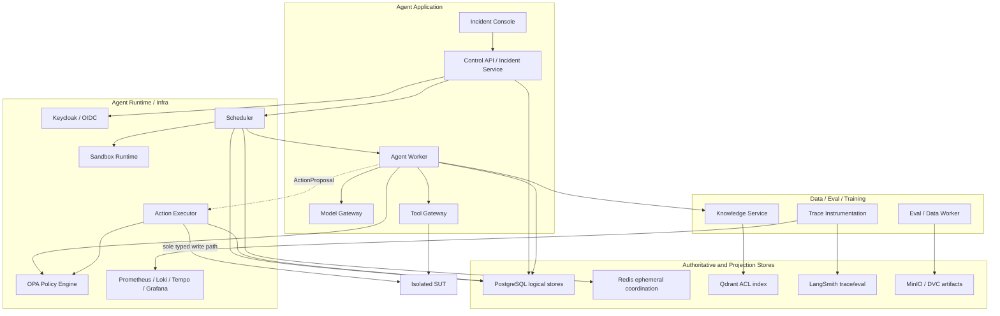

# Container Architecture

## 组织原则

三个强制工程平面描述交付责任，五个逻辑平面描述运行时职责。它们不是三个独立项目：一次 Incident 会穿过 Experience、Control、Data、Execution、Evaluation，并由 Agent Application、Runtime/Infra、Data/Eval/Training 共同完成。

## 组件职责表

机器可读的完整输入、输出、信任等级、数据真源和调用关系位于 `ARCHITECTURE.yaml`。以下为决策摘要。

| Component | 唯一职责 | 不拥有的能力 |
| --- | --- | --- |
| Incident Console | 呈现真实状态、Evidence、审批和 Final Report | 不推断状态，不接触凭据或 Ground Truth |
| Control API / Incident Service | 认证 Command、拥有 Incident Lifecycle、写 Outbox | 不租赁 Worker，不执行 SUT 写动作 |
| Scheduler | 拥有 Runtime Task、quota、lease、fencing、backpressure | 不修改 Incident 或 Agent checkpoint |
| Agent Worker | 执行有界调查图并拥有 Graph checkpoint | 不直接写 SUT，不把 LLM 输出当授权 |
| Model Gateway | 统一模型结构化输出、预算、重试、fallback 和 usage | 不拥有业务状态，不持有 SUT 凭据 |
| Tool Gateway | 执行有 schema 和 scope 的只读域工具 | 不提供任意 shell/Kubernetes 写能力 |
| Knowledge Service | ACL/freshness 前置过滤、索引、provenance、memory | 不读取 locked Ground Truth |
| OPA Policy Engine | 决定 risk、scope、obligation 和 allow/deny | 不执行 action，不生成审批 |
| Action Executor | 独占 ActionTransaction 和所有 typed write | 不接受模型输出直连，不跳过 digest/approval |
| Sandbox Runtime | 执行已准入、隔离、限额、限网的计算任务 | 不成为动作或宿主机旁路 |
| Trace Instrumentation | 脱敏、关联和持久化 Trace/Eval 记录 | 不保存 private chain-of-thought 或 secret |
| Eval/Data Worker | 拥有 Artifact/Dataset、TrajectoryIR 和 evaluator | 不向 Agent 暴露 locked split/answers |

## 数据真源

- PostgreSQL 按逻辑所有权分别保存 Incident、Task/Lease、Checkpoint、ActionTransaction；共享数据库技术不意味着共享写权限。
- Redis 只作短期队列、计数和协调，不是任何业务状态真源。
- Qdrant 是可重建检索投影；文档版本、ACL、tombstone 和 provenance 必须可追踪。
- LangSmith 是 Agent Trace/Eval 的权威记录；本地 outage buffer 只提供恢复，不改变关闭 Gate 所需证据。
- MinIO/DVC 是 Artifact/Dataset 的权威版本资产，UI 和 Agent 使用引用而不是无限载荷。

## 交互规则

组件可以同步读取或查询，但不能直接修改别人的状态。跨所有权写入使用 Command；状态变化与 Outbox 在同一事务提交，Event 消费按 `event_id` 去重。所有写 Command 带幂等键和 `expected_state_version`，Task commit 另带有效 fencing token。

## 关联视图

- [System Context](SYSTEM_CONTEXT.md)
- [Data and Control Flow](DATA_AND_CONTROL_FLOW.md)
- [Deployment and Trust Boundaries](DEPLOYMENT_AND_TRUST_BOUNDARIES.md)
- [State Machines](STATE_MACHINES.md)
