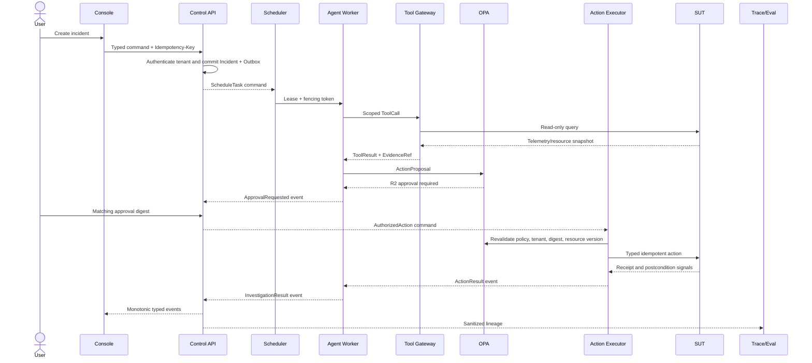

# Data and Control Flow

## 正常控制流

同步调用只用于有界查询或授权决定；所有跨状态 owner 的修改均由类型化 Command 触发，并以 Outbox Event 宣告结果。Command 接收方验证 tenant、schema version、幂等键、预期状态版本及其自身授权。

## 数据分类与方向

| 数据 | 生成者 | 真源 | 主要消费者 | 禁止流向 |
| --- | --- | --- | --- | --- |
| TenantContext | Identity Provider / Control API | 验证后的 token snapshot | 所有请求级组件 | 模型 prompt 中的凭据、用户自报 tenant |
| Incident State | Control API | Incident PostgreSQL | Console、Scheduler、Eval | Agent Worker 直接写 |
| Task/Lease | Scheduler | Task PostgreSQL | Agent Worker、Sandbox | 过期 Worker commit |
| Agent checkpoint | Agent Worker | Checkpoint PostgreSQL | 恢复 Worker、Eval | 其他组件 reducer 写入 |
| EvidenceRef | Tool/Knowledge service | Artifact/Source version + trace lineage | Agent、Console、Eval | 无界原始载荷、跨租户检索 |
| Action digest/grant | Action Executor / Approver | Action PostgreSQL | Action Executor、Audit | 参数变化后的复用、模型自批 |
| Trace/Eval | Instrumentation | LangSmith | Eval/Data Worker、AgentOps | secrets、private reasoning、locked answer |
| Dataset/Artifact | Eval/Data Worker | MinIO/DVC | Evaluator、authorized training job | Agent Runtime、普通开发凭据 |

## Outbox 和至少一次投递

1. Owner 在同一数据库事务写状态与 outbox record；事务失败时两者都不提交。
2. Publisher 可重复发布未确认事件，不制造“已发布即 exactly-once”的承诺。
3. Consumer 以 `event_id` 和业务幂等键去重，在自己的状态版本上应用 Command/Event。
4. Runtime Task 每次执行使用新 `attempt_id`；原 `task_id` 保持不变。
5. Worker 提交必须携带当前 fencing token；lease 丢失后的旧 token 永久失效。

## 固定失败语义

| Fault | Required behavior |
| --- | --- |
| OIDC/Tenant invalid | Reject before Incident creation; never accept tenant from the body |
| Duplicate create/approval/cancel | Return the original result for the same idempotency key and compatible digest |
| Database transaction failure | Commit neither state nor outbox |
| Outbox publish failure | Retry publication; consumer deduplicates by event ID |
| Worker lease loss | Fence old worker; create a new attempt from committed checkpoint |
| Model/tool transient failure | Bounded retry; degrade or escalate after exhaustion |
| Invalid structured output | Bounded repair; escalate if still invalid |
| Qdrant unavailable | Mark knowledge missing and block writes dependent on that knowledge |
| MinIO unavailable | Pause large-result path; never stuff unbounded payload into context |
| LangSmith unavailable | Buffer locally; allow qualified reads only; writes fail closed and Gate cannot close |
| OPA unavailable | All write actions fail closed |
| Keycloak unavailable | Reject new requests/approvals; an existing read-only run may finish on a valid snapshot |
| Action response lost | Enter `UNCERTAIN`, reconcile first, never blind-retry |
| Postcondition failure | Compensate when defined; otherwise manual handling and Incident escalation |
| Compensation unknown | Remain uncertain then enter manual reconciliation |
| Cancel | Apply at a safe checkpoint; reconcile possible side effects before terminal cancellation |
| Ground Truth access | Deny Agent, Runtime, and normal developer credentials |

## Walkthrough 覆盖

EVAL-G00-004 逐项检查 `ARCHITECTURE.yaml` 的 `W-ARCH-001` 至 `W-ARCH-010`：只读成功、R2 成功、拒绝/过期、lease 丢失、action 响应丢失、验证失败并补偿、补偿不确定、cancel、LangSmith/OPA/Keycloak 故障、跨租户访问。I-0005 会把这些路径绑定到具体状态转换、Command/Event 和接口错误。

## 关联视图

- [System Context](SYSTEM_CONTEXT.md)
- [Container Architecture](CONTAINER_ARCHITECTURE.md)
- [Deployment and Trust Boundaries](DEPLOYMENT_AND_TRUST_BOUNDARIES.md)
- [State Machines](STATE_MACHINES.md)
