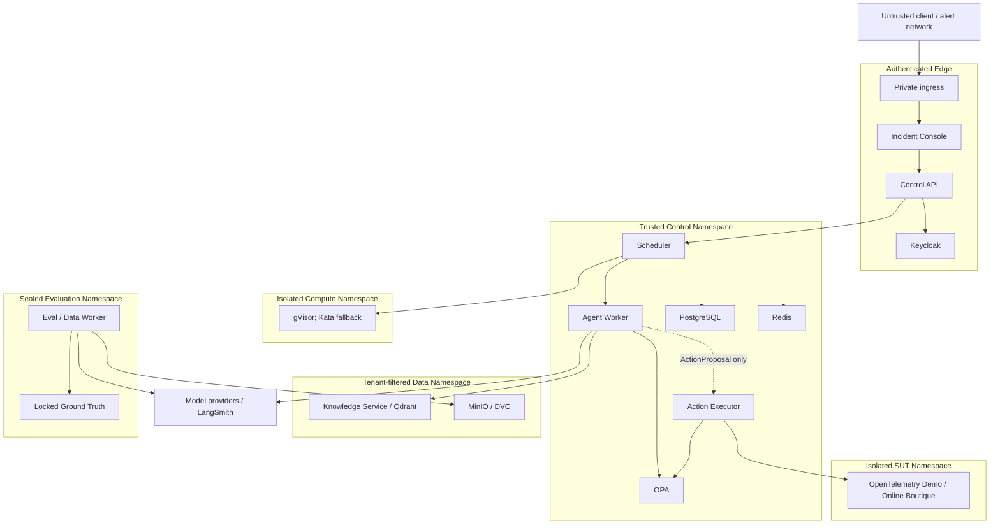

# Deployment and Trust Boundaries

## 逻辑部署视图

G00 只冻结部署和信任边界，不部署 K3s、Keycloak、OPA、Qdrant、MinIO、LangSmith 或 Sandbox。具体资源尺寸、replica、lease 时长和 NetworkPolicy 规则在对应 Gate 通过实验确定。

## 信任区和身份

| Zone | Workload identity | Network rule | Data rule |
| --- | --- | --- | --- |
| Authenticated edge | End-user OIDC and API service account | Only private ingress and explicit backend calls | `tenant_id/user_id/roles` only from validated token |
| Trusted control | Per-service workload identity | Deny by default; explicit service-to-service allowlist | Each owner has write access only to its logical state/store |
| Constrained Agent | Worker/Tool/Model identities without action credentials | Only approved gateways and provider endpoints | No Ground Truth, no secret store, no direct SUT write |
| Privileged execution | Action Executor identity scoped by environment and adapter | Only OPA, action store, audit, and allowlisted SUT write endpoints | Short-lived delegated credential; immutable digest and full audit |
| Tenant data | Knowledge/Evidence identities with tenant policy | Query service only, no direct cross-namespace DB path | ACL and freshness filter before ranking |
| Sandbox | Per-job ephemeral identity | Deny default; signed allowlist only | Ephemeral filesystem, resource quota, no host or action credential |
| Sealed evaluation | Evaluator/training identities | No inbound path from Agent Runtime | Locked splits and answers separated from dev/train and runtime |

## 多租户不变量

- TenantContext 只由 OIDC/JWT 产生，并贯穿 Command、Event、store policy、retrieval filter、artifact prefix 和 action authorization。
- PostgreSQL 使用应用层 owner constraint 与 RLS；Qdrant 在召回前做 ACL/freshness filter；MinIO 按租户/数据等级分区。
- Cache key、queue key、trace tag、metric dimension 和 idempotency scope 必须包含认证 tenant，不接受 body/header 的替代值。
- 跨租户读取、写入、检索、Trace 查询和 action 均为零容忍；拒绝发生在结果生成或 dispatch 之前。

## Action 与 Sandbox 边界

Action Executor 和 Sandbox 是不同信任域。Sandbox 处理被准入的计算，不持有 SUT 写凭据；Action Executor 只支持版本化 typed adapters，不提供通用 shell。Agent Worker 不能通过 Tool Gateway、MCP、Sandbox、callback 或 compensation 绕开 Action Executor。

R2 ApprovalGrant 绑定 tenant、environment、action type、canonical parameters、resource version、pre/postcondition、compensation、risk、approver scope、expiry 和 single-use token。任一绑定字段变化都要求新 digest 和新审批。

## Ground Truth 与训练边界

Scenario inputs 可以按 split 提供给 Runtime，但 locked expected result、fault labels、judge rubric 和 hidden benchmark answer 只在 sealed evaluator 可读。训练仅消费已批准的 train lineage；validation、locked test 和外部 benchmark 永不进入训练、Prompt 构建、memory 或 retrieval index。

## Secret 和外部依赖

- SOPS + Age 管理部署秘密；Git、Prompt、Trace、artifact metadata 和测试输出不保存明文 secret。
- 外部模型和 LangSmith 只接收最小化、脱敏、可归因 payload；出站域名和用途有 allowlist。
- Keycloak、OPA 或 mandatory trace 不可用时，新的高风险路径 fail-closed；不得用缓存的宽权限或默认 allow 恢复写入。

## 关联视图

- [System Context](SYSTEM_CONTEXT.md)
- [Container Architecture](CONTAINER_ARCHITECTURE.md)
- [Data and Control Flow](DATA_AND_CONTROL_FLOW.md)
- [State Machines](STATE_MACHINES.md)
- [Threat Model](../security/THREAT_MODEL.md)
