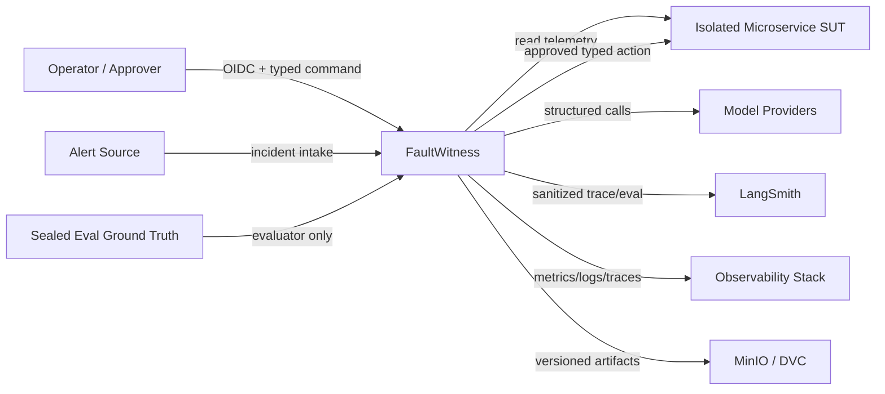

# FaultWitness System Context

## 目的与边界

FaultWitness 是面向微服务事故调查、受控修复和持续优化的多租户 Agent Runtime。它把 Agent Application、Runtime/Infra、Data/Eval/Training 作为同一产品的三个强制工程平面：代码和部署职责解耦，但路线和最终验收不可选。

主线覆盖发布、配置、路由和版本变化的因果归因与安全回滚，并扩展到资源、容量、依赖、网络、数据面和运行时故障。它不是任意领域 Agent 平台、插件市场、生产运维托管服务或公网执行入口。

## 上下文图

Ground Truth 箭头只进入 sealed evaluator，Agent Worker、普通 Runtime 身份和开发凭据不存在反向读取路径。模型输出和检索内容一律视为不可信数据。

## 人与外部系统

| Actor/System | 信任与能力 | 明确限制 |
| --- | --- | --- |
| Operator | 已认证租户用户，可创建、查看、取消 Incident | 不能通过请求字段切换 tenant，不能直接写 SUT |
| Approver | 具备特定环境和风险范围的审批角色 | 审批只绑定不可变 action digest，不能授权变更后的参数 |
| Alert Source | 非交互来源，可提供告警引用 | 内容不可信，必须归一化和限定 scope |
| Model Provider | 生成结构化候选输出 | 无系统状态所有权、无凭据、无直接工具或动作权限 |
| Microservice SUT | 提供遥测、资源快照和受控动作适配器 | 与 Eval Ground Truth、项目控制存储隔离 |
| LangSmith | Trace、Dataset、Experiment、Eval 的强依赖 | 只接收脱敏数据；不可用时写动作 fail-closed，Gate 不关闭 |
| Artifact Store | 保存大型证据、数据集和模型版本 | Agent 上下文只接收引用和有界摘要 |
| Sealed Evaluator | 持有 locked cases 和 Ground Truth | 与 Agent/Runtime 凭据、网络和数据路径隔离 |

## 系统承诺

- Incident、Runtime Task、Agent Graph、ActionTransaction 分别拥有状态和写入者。
- 跨组件协调只使用类型化 Command 与 Transactional Outbox Event。
- Agent 只产生 ToolCall 和 ActionProposal；Action Executor 是唯一 SUT 写入口。
- Runtime 采用至少一次投递、幂等消费者与 fencing，不宣称分布式 exactly-once。
- 不保存模型私有思维链，只保存可审计的结构化决策、公开理由和 EvidenceRef。

## 关联视图

- [Container Architecture](CONTAINER_ARCHITECTURE.md)
- [Data and Control Flow](DATA_AND_CONTROL_FLOW.md)
- [Deployment and Trust Boundaries](DEPLOYMENT_AND_TRUST_BOUNDARIES.md)
- [State Machines](STATE_MACHINES.md)
- [Threat Model](../security/THREAT_MODEL.md)
