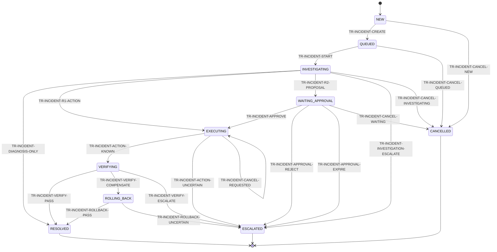
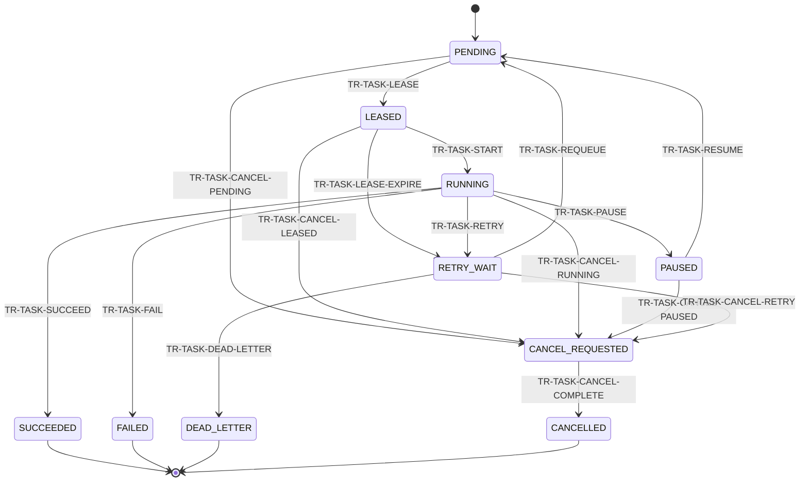
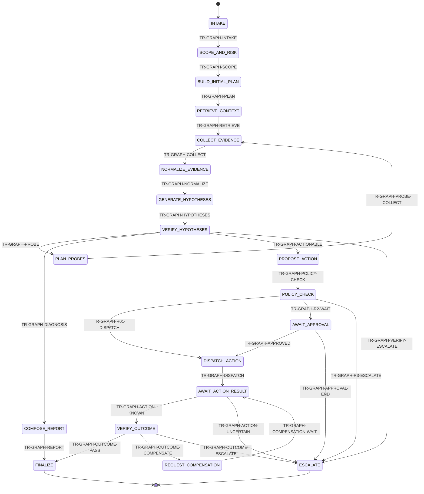
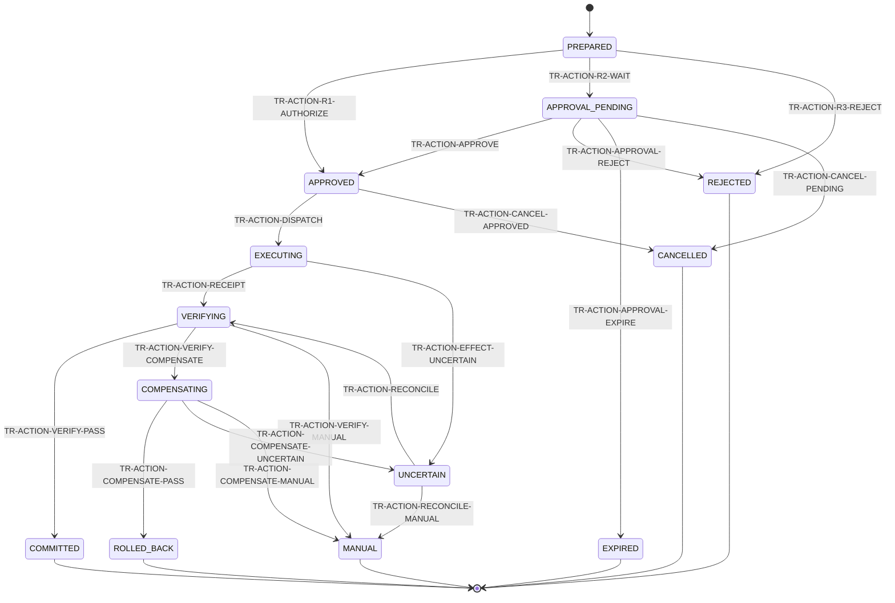

# Generated State Machine Diagrams

<!-- GENERATED from docs/contracts/state-machines/*.yaml; do not edit by hand. -->

The YAML transition tables are the single source of truth. `faultwitness_dev validate` compares this document byte-for-byte with the renderer.

## Incident Lifecycle

Owner: `CMP-CONTROL-API`; store: `STORE-INCIDENT-POSTGRES`.

Invariants:

- R2 execution requires an unexpired approval that matches tenant environment action digest and resource version.
- RESOLVED always has a Final Report and attributable postcondition or diagnosis-only evidence.
- UNCERTAIN or MANUAL ActionTransaction forces Incident escalation.
- Terminal Incident states never transition in place; later feedback appends events.

## Runtime Task

Owner: `CMP-SCHEDULER`; store: `STORE-TASK-POSTGRES`.

Invariants:

- Delivery is at least once and every retry uses a new attempt_id under the stable task_id.
- Only the current fencing token can checkpoint complete fail pause or dispatch downstream work.
- PAUSED tasks do not retain a worker lease.
- No distributed exactly-once behavior is claimed.

## Agent Graph

Owner: `CMP-AGENT-WORKER`; store: `STORE-CHECKPOINT-POSTGRES`.

Invariants:

- The graph emits ToolCall and ActionProposal only and has no shell Kubernetes or direct SUT write capability.
- LLM decision nodes are separated from deterministic policy execution reducers and state commits.
- Every important transition checkpoints step tool token cost deadline and no-progress budgets.
- Private chain-of-thought is never persisted; public rationale is structured and evidence linked.

## ActionTransaction

Owner: `CMP-ACTION-EXECUTOR`; store: `STORE-ACTION-POSTGRES`.

Invariants:

- Action Digest binds tenant environment action parameters resource version preconditions postconditions compensation risk approver expiry and single-use token.
- Action Executor is the sole component with SUT write credentials and arbitrary shell or Kubernetes writes are prohibited.
- COMMITTED requires successful postcondition evidence and R2 dispatch requires a matching immutable approval.
- UNCERTAIN has no automatic outgoing transition and permits reconciliation or manual handling only.
