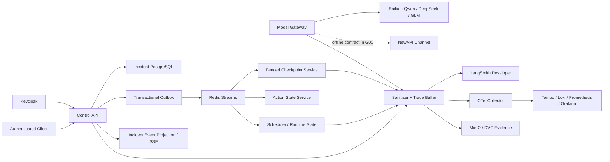

# G01 Gate Master Plan：平台契约、持久化与 Trace 地基

## 1. Gate 目标

G01 将 G00 的设计契约变成可部署、可恢复、可观测的真实平台地基，使 G02/G03 无需重新决定：

- G00 四层状态机如何映射为 Pydantic v2 类型、确定性转换服务和 PostgreSQL 真源。
- state、idempotency、checkpoint、transactional outbox、inbox deduplication 和 Redis Streams 如何组合。
- 冻结的八个 REST/SSE path 如何在真实 OIDC、持久化和事件恢复语义下运行。
- ModelGateway 如何统一 Qwen、DeepSeek、GLM 三个模型族和 Bailian/NewAPI 两个 channel。
- LangSmith、OpenTelemetry、Tempo 和本地证据资产如何形成脱敏、可归因、可重放的 Trace 地基。
- 现有共享服务器如何在不影响既有 Docker workload 的前提下运行单节点 K3s、数据服务、隔离 Runtime 和 RTX 4090 smoke。

本 Gate 关闭时只允许声称“平台契约、状态持久化、事件投递、API/SSE、模型网关与 Trace 地基真实运行”。不得声称 Agent 调查质量、RAG、真实写动作、多租户规模化、Sandbox 安全性或训练已经完成。

## 2. 范围、非目标与依赖

### 2.1 范围

- 安全的本地秘密入口、专用 SSH key、SOPS + Age 和 K3s Secret encryption at rest。
- 与现有 Docker 并存的 pinned single-node K3s、Helm、embedded etcd、namespace、quota 和 default-deny NetworkPolicy。
- PostgreSQL、Redis、Qdrant、MinIO、Keycloak、OPA、OpenTelemetry Collector、Prometheus、Loki、Tempo 和 Grafana。
- gVisor、Kata 和 NVIDIA RuntimeClass/capability smoke；不建设 Sandbox 产品接口。
- G00 21 个核心类型、52 个状态、82 条转换和 G01 support type 的可执行 Pydantic contract。
- Owner-isolated PostgreSQL schema/role、Alembic migration、状态版本、幂等、Outbox、Inbox、DLQ 和 checkpoint。
- 八个冻结 REST/SSE path 的完整平台壳。
- Bailian live channel、NewAPI OpenAI-compatible channel、三模型族 smoke、retry、repair、stream 和 fallback semantics。
- LangSmith Developer、OTel/Tempo、自托管 operational telemetry、bounded outage buffer 和长期 evidence manifest。
- Windows/Ubuntu public CI、private-server Eval、SBOM、License、Secret 和 immutable candidate audit。

### 2.2 非目标

G01 不得：

- 实现 LangGraph 事故调查节点、Prompt、Evidence Collector、Hypothesis/ProbePlan 推理闭环。
- 实现真实 Tool、RAG、Memory、Skill、Incident Console 或微服务 SUT。
- 执行 Kubernetes/SUT 写动作、Action Adapter、后置验证或补偿。
- 宣称完成 PostgreSQL RLS、Qdrant ACL、1–4 Worker 扩展或 G06 Sandbox escape 验证。
- 运行模型诊断质量、故障成功率、模型消融或成本优化 Eval。
- 建设多节点 K3s、HA、跨地域、生产 SLA 或公网产品入口。
- 在没有令牌时伪造 NewAPI live evidence。
- 把百炼上的三个模型族表述为三家独立 Provider 或跨供应商容灾。
- 以 Langfuse、Helicone、Laminar 或本地 Trace 替换已经接受的 LangSmith 强依赖。

### 2.3 已确认环境

只读能力探测确认目标服务器具备：

- x86_64、32 CPU、64 GiB RAM、NVMe 和 RTX 4090 24 GiB。
- Ubuntu 20.04、kernel 5.15、cgroup v1、KVM、seccomp 和 user namespace。
- Docker、containerd 和 NVIDIA Container Toolkit；K3s、kubectl、Helm、gVisor、Kata 尚未安装。
- 现有 Docker workload 占用 80/443；K3s 必须禁用 Traefik/ServiceLB 且不得改变现有 container/port/health。
- Docker network 使用 172.17/16–172.19/16；K3s 使用 10.42/16 和 10.43/16，不与其重叠。

能力事实只进入脱敏报告；服务器 IP、SSH user、port、host fingerprint 和 Secret 不进入 Git。

### 2.4 固定外部依赖

- G00 已在 `gate/G00-v1` 无 waiver 关闭。
- 当前 Bailian credential 用于 G01 live model smoke。
- LangSmith Developer credential 已由项目所有者准备，但只能在 I-0007 通过秘密入口迁移后使用。
- NewAPI token 尚未取得，不是 G01 closure dependency；live channel evidence 是取得 token 后首个 Runtime Gate 的 start condition。
- 安装 K3s/runtime 需要一次受控 sudo bootstrap；后续部署使用 project-scoped Kubernetes identity。
- Public CI 不接收服务器、模型、LangSmith、Kubernetes administrator 或 production-like Secret。
- 所有 live API 调用、部署和 privileged test 只能在对应 Iteration 明确进入 `in_progress` 后执行。

## 3. Frozen Platform Architecture

### 3.1 部署拓扑



Namespaces：

- `fw-control`：Control API、Scheduler、state consumer、Outbox Publisher、ModelGateway、OPA。
- `fw-data`：PostgreSQL、Redis、Qdrant、MinIO。
- `fw-observability`：OTel Collector、Prometheus、Loki、Tempo、Grafana。
- `fw-eval`：Eval Runner、Toxiproxy 和临时 failure-injection Job，不持有 Runtime credentials。

部署不变量：

- 所有业务 Service 使用 `ClusterIP`；管理和调试只经 SSH tunnel。
- Namespace 默认拒绝 ingress/egress，只开放 DNS、显式内部调用、Bailian 和 LangSmith egress。
- 总 requests 不超过 12 CPU/20 GiB，总 limits 不超过 24 CPU/40 GiB。
- K3s 使用 embedded etcd、定时 snapshot 和 Secret encryption at rest。
- 镜像、Chart、Action 和安装二进制固定 digest/checksum；禁止 floating `latest`。
- K3s 版本取实施时仍支持 kernel 5.15/cgroup v1 的最新稳定 patch。若不存在，I-0008 必须失败并新增 OS/VM ADR，禁止强装。

### 3.2 数据与身份隔离

PostgreSQL 使用一个物理 cluster 和独立 database role/schema：

- `incident`：Incident Lifecycle、Incident idempotency、Incident Outbox、SSE projection。
- `runtime`：Runtime Task、attempt、lease 和 fencing token。
- `checkpoint`：Agent Graph checkpoint 和 graph Outbox。
- `action`：ActionTransaction、approval/digest placeholder 和 action Outbox。
- `delivery`：publisher lease、Inbox、DLQ 和 operational delivery state。
- `trace_buffer`：sanitized trace export buffer。
- `keycloak`：identity provider persistence。

规则：

- 每个 workload identity 只能写自己的 schema；共享物理数据库不产生跨 owner 写权限。
- Redis 只承担 Streams、consumer group 和短期协调，不是业务状态真源。
- Qdrant 是未使用业务数据的 capability deployment；G04 才建立 ACL/freshness retrieval semantics。
- MinIO 为私有 Artifact/Eval store；Runtime、Eval 和 future locked data 使用不同 identity/prefix。
- Keycloak 在 G01 建立两个 synthetic tenant 和四角色测试 realm；G06 再完成完整 RBAC/RLS/ACL hardening。

### 3.3 RuntimeClass 与 GPU

- 注册 `RuntimeClass/gvisor` 与 `RuntimeClass/kata`，各运行实际 unprivileged Pod smoke。
- NVIDIA runtime 只配给普通 runc GPU workload；G01 不组合 GPU 与 gVisor/Kata。
- G01 capability report记录 runtime version、kernel/KVM、startup、network、volume 和失败原因。
- G06 才实现 signed sandbox job、filesystem/network policy、escape/secret test 和 product scheduling。

## 4. Secret 与 Publication Design

### 4.1 本地秘密

- 生成 project-specific SSH Ed25519 key；验证 key login 后才停止使用旧登录凭据。
- 首次 host key 由人工比对并固定，部署脚本不得使用自动接受策略。
- Age identity 与真实 SOPS 文件位于 repository 之外的用户配置目录。
- Git 只保存 secret schema、`.sops.yaml` policy 和无值示例，不保存真实或 encrypted project secret。
- 解密只发生在进程内；Kubernetes Secret 通过受控 stdin/API 创建，不落地 plaintext manifest。
- `envs.txt` 在 I-0007 验证迁移后普通删除并精确 ignore；不声称 SSD 普通删除是 secure erase。
- `envs.txt` 从未进入 Git，publication/history scan 为零泄漏时，服务器密码、Bailian key 与 LangSmith key 按项目所有者决定作为 long-lived credential 原值迁移并持续使用；确认泄漏或所有者撤销才触发轮换。
- 三项 credential 均从一次性 handoff 直接迁移到仓库外 SOPS，不创建 replacement，不把值、可逆 hash 或 suffix 写入证据。

### 4.2 Public CI 与证据

- GitHub Actions 使用 synthetic credential 和 fake upstream，不持有 live Secret。
- Live Bailian、LangSmith、K3s 和 privileged runtime Eval 由本地 private runner 发起。
- Public report 只保存 candidate SHA、sanitized metrics、run ID、artifact digest 和受控 evidence URL。
- Raw trace、server log、Kubernetes admin config 和 private failure payload 保存在私有 MinIO/evidence store。
- Secret/PII scanner覆盖 Git/history、stdout/stderr、HTTP/SSE、Prompt、logs、Trace、Redis、PostgreSQL、MinIO、Kubernetes 和 Eval artifact。

## 5. Executable Contract Design

### 5.1 Authority 与生成

G00 state-machine YAML、Command/Event Catalog、Type Catalog、OpenAPI、AsyncAPI 和 Failure Semantics 继续是规范源。

- 确定性 compiler 将规范编译为 package resource，并记录 source digest。
- Generated output 不手工编辑；CI 重新生成并 byte-compare。
- Guard 使用显式 Python predicate registry，禁止执行 YAML 字符串表达式。
- Unknown Actor、Guard、Command、Event 或 schema version 使 service startup 失败。

### 5.2 类型

实现 G00 的 21 个核心类型，并增加 G01 support type：

- `CommandEnvelope`、`OutboxRecord`、`InboxRecord`。
- `CheckpointWrite`。
- `IncidentFeedback`、`StreamControlEvent`。
- `ModelRequest`、`ModelResponse`、`ModelChunk`、`ModelUsage`。
- `TraceEnvelope`、`SpanRecord`。

边界规则：

- Pydantic v2 boundary type 使用 `extra="forbid"`。
- 时间统一 UTC；ID 使用带类型 prefix 的 ULID，顺序仍以数据库 sequence 为权威。
- Public request 不含 `tenant_id`、`user_id`、`roles`；这些值只由验证后的 OIDC claim 产生。
- Canonical request digest 使用稳定 JSON canonicalization；same key/different digest 必须返回 409。
- Existing public path 不破坏兼容；新增内部契约使 `contracts_version` target 为 `1.1.0`。

### 5.3 状态转换事务

每个 owner-specific transition service 在单一 owner transaction 中：

1. 校验 authenticated tenant、schema version、idempotency scope 和 owner。
2. 锁定 aggregate，校验 `state_version` 或 fencing token。
3. 执行 guard 和 structured precondition。
4. 修改 owner state 并递增 version。
5. 同事务写 Outbox 和 idempotent response。
6. 提交后由独立 publisher 投递 Event。

Terminal state 不可原地修改；feedback、audit 和 reconciliation evidence 只 append。

### 5.4 Supporting state machines

| Mechanism | States and semantics |
| --- | --- |
| Outbox | `PENDING → CLAIMED → PUBLISHED`；claim 过期回 `PENDING`；publish 失败只增加 attempt/backoff，不丢弃。 |
| Inbox | `RECEIVED → APPLIED`；duplicate 进入 `DUPLICATE_ACK`；poison/incompatible message 进入审计 DLQ，绝不修改业务状态。 |
| Trace Export | `BUFFERED → EXPORTING → EXPORTED`；dependency failure 回 `BUFFERED`；sanitizer rejection 进入 `REJECTED` 且禁止出站。 |
| Model Invocation | `ACCEPTED → INVOKING → REPAIRING/RETRYING/FALLBACK → SUCCEEDED`；首个 chunk 后失败只能进入 `PARTIAL_FAILED`。 |
| SSE Connection | `OPEN → REPLAY → LIVE → CLOSED`；expired cursor 发 typed gap event 后关闭；slow consumer 可从最后 cursor 恢复。 |

这些是 operational lifecycle，不替代 G00 四套 domain state machine。

### 5.5 Fenced checkpoint

- 使用 LangGraph `AsyncPostgresSaver` interface semantics，但禁止裸用默认 Saver。
- `FencedPostgresSaver` 在同一 PostgreSQL transaction 内读取只读 active-lease view，并校验 tenant、task、attempt、fencing token 和 expiry。
- 使用 encrypted serializer，禁止 pickle fallback。
- Checkpoint 与对应 graph Event/Outbox 同事务提交。
- crash-before-checkpoint 重做当前 step；crash-after-checkpoint 从下一 step 恢复。

## 6. Outbox、Redis Streams 与 SSE

### 6.1 Delivery

八个 AsyncAPI channel 绑定同名 Redis Stream：

- Publisher 使用 `FOR UPDATE SKIP LOCKED` claim Outbox；XADD 成功后才标记 published。
- Consumer 使用 XREADGROUP；业务 transaction 同时写 Inbox dedupe 和 owner state，commit 后才 XACK。
- crash-after-XADD 和 crash-after-commit 都允许重复 delivery，但不得重复 state mutation。
- Outbox 超过 10,000 row 或 oldest age 超过 60 秒时 readiness 失败，新 intake 返回 503。
- Invalid schema/poison event 不推进业务状态；达到 10 次 delivery attempt 后进入 DLQ 并使 Gate readiness 失败。

### 6.2 SSE

- Control API 消费 Incident 相关 Event，建立 durable event projection 并分配严格递增 `feed_sequence`。
- Cross-owner ordering 以 projection commit 为准，correlation/causation 保留因果链。
- SSE retention 为 7 天或每 tenant 100,000 条的先到者；Domain Event 按审计策略继续保留。
- Valid `Last-Event-ID` 返回全部更大 sequence。
- Expired cursor 发 `stream.retention_gap.v1` 后关闭；invalid/future cursor 返回 400/409。
- 每连接 buffer 256、heartbeat 15 秒、单批 100；slow consumer 关闭后从最后已发送 ID 恢复。
- Event 只包含 typed public rationale、state、EvidenceRef 和 error；不含 private reasoning。

## 7. REST 与 Identity

冻结的八个 path 全部实现：

- `POST /v1/incidents`
- `GET /v1/incidents/{incident_id}`
- `GET /v1/incidents/{incident_id}/events`
- `POST /v1/incidents/{incident_id}/approvals`
- `POST /v1/incidents/{incident_id}/cancel`
- `POST /v1/incidents/{incident_id}/feedback`
- `GET /v1/tools`
- `GET /v1/skills`

固定行为：

- JWT 验证 issuer、signature、audience、expiry 和 scope；body/header identity field 被 schema 拒绝。
- Create 同事务写 `NEW` Incident 和 Outbox；Scheduler 消费后进入 `QUEUED`。
- Approval 只在真实 pending state 和匹配 digest 时成功；没有 proposal 返回 404/409，绝不伪造成功。
- Cancel/feedback 使用 expected state version；feedback 为 append-only。
- Tools/skills 未实现时返回真实空 array，不返回 fake capability。
- Service 只在 cluster 内公开 `/health/live`、`/health/ready`、`/metrics`。
- Keycloak outage 时拒绝新 request/approval；已建立 SSE 只持续到 token expiry。

## 8. ModelGateway

### 8.1 Interface

Internal API：

- `POST /internal/v1/model/complete`
- `POST /internal/v1/model/stream`
- `GET /internal/v1/model/capabilities`

`ModelRequest` 包含 request/correlation ID、model family、exact model ID、messages、target JSON Schema、tool schema、stream flag 和 budget snapshot；不得包含 API key、OIDC token 或 raw user identity。

### 8.2 Channel 与 routing

- `BailianChannel`：G01 live，提供 Qwen、DeepSeek、GLM 三模型族。
- `NewAPIChannel`：OpenAI-compatible；G01 对 fake server 完成 complete、structured、tool、stream、usage、429、5xx、timeout 和 malformed chunk contract。
- 每个模型族选择账户实际可用的最新 non-thinking、tool-capable 固定 snapshot；禁止 `*-latest`。
- Route configuration version、channel、model、retry 和 fallback 全部进入 Trace/version bundle。
- 该设计只证明 multi-family routing，不证明 upstream failure independence。

### 8.3 Retry、repair 与 stream

- 429、408、5xx、connect/read timeout：同 route 最多 retry 1 次，使用 full-jitter backoff。
- 4xx configuration/auth error 不 retry。
- Invalid structured output：同 model 最多 repair 1 次；仍无效且未输出时才允许 fallback。
- 任一 stream chunk 已对 caller 可见后禁止切换模型续写。
- Structured Output 优先 native JSON Schema；不支持时使用 forced `emit_result` tool。未校验的 prompt-only JSON 不算通过。
- Tool smoke 使用 forced tool choice，arguments 必须通过相同 Pydantic Schema。
- Stream 必须可确定性重建 final content/tool call；final chunk 含 usage 或 typed `usage_unavailable`。
- Price 未知写 `unknown`，禁止猜测费用。

## 9. Trace 与 Eval Evidence

### 9.1 Backend decision

G01 继续执行 ADR-0003：

- LangSmith Developer 是 Agent/Model/Eval 交互式权威 Trace backend。
- OTel Collector → Tempo/Loki/Prometheus 是自托管 operational telemetry。
- MinIO/DVC 保存 candidate SHA、version bundle、run ID、sanitized manifest 和 digest 的长期 evidence。
- LangSmith 14 天 base retention 不通过发送更多敏感 payload 或保留 private reasoning 解决。
- G01 trace budget 固定为 1,500 base traces；达到上限后 fail-closed，不采样隐藏缺失。

### 9.2 Sanitization 与 buffer

- LangSmith metadata 只含 candidate/release/model/channel/contract version 和 synthetic tenant HMAC pseudonym。
- 不发送真实 user ID、token、server address、Secret 或 private chain-of-thought。
- G01 不启用会自动升级 retention 的 feedback/annotation feature。
- Trace export 前执行 field allowlist、Secret/PII scan 和 payload size limit。
- PostgreSQL buffer 上限 256 MiB/24 小时，不静默淘汰；满后拒绝新工作。
- LangSmith outage 可有界 buffer/replay，但 Gate 关闭前 buffered/rejected production trace 必须为 0。
- Eval 完成后立即生成 sanitized evidence manifest，不依赖 UI retention 作为唯一长期证据。

### 9.3 Latency reconciliation

Stage taxonomy：

- `auth`、`api`、`persistence`、`outbox`、`scheduler`、`checkpoint`。
- `model`、`tool`、`retrieval`、`policy`、`approval`、`action`、`trace_export`。

只要求实际发生的 stage 有 span。Waterfall 使用 interval union 和 critical path，不直接相加并行 child span。Root duration 与外部 wall time 差异不得超过 `max(50 ms, 5%)`。

## 10. Fixed Failure Semantics

| Fault | Required behavior |
| --- | --- |
| OIDC invalid / Keycloak unavailable | 在 state write 前拒绝；新 request/approval fail-closed。 |
| Duplicate request | same key/same digest 返回原结果；same key/different digest 返回 409。 |
| PostgreSQL transaction failure | state、idempotency result 和 Outbox 均不提交。 |
| Redis / Outbox publish failure | state 保持 committed；Outbox 保留并重发，backlog 超限后停止新 intake。 |
| Duplicate Event | Inbox dedupe，业务 state version 只增加一次。 |
| Stale state version | 返回 409，不覆盖新状态。 |
| Stale/expired fencing token | checkpoint、complete 和 dispatch 全部拒绝。 |
| Checkpoint crash | checkpoint 前重做当前 step；checkpoint 后从下一 step 恢复。 |
| Invalid structured output | 一次 repair；仍失败则 pre-output fallback 或 typed failure。 |
| Stream interrupted | `PARTIAL_FAILED`；禁止跨模型拼接。 |
| LangSmith unavailable | 有界 buffer；Gate 不关闭；buffer 满后拒绝新工作。 |
| OPA unavailable | approval/action authorization fail-closed。 |
| Secret/PII canary | sanitizer 阻止出站并记录安全事件，不记录原值。 |
| SSE retention gap | 发送 typed gap event 后关闭，client 重新同步 snapshot。 |
| SSE backpressure | 关闭 slow connection，保留最后 cursor，不阻塞 publisher。 |

## 11. Iteration Breakdown

### I-0007：Secure Bootstrap and Capability Baseline

范围：

- Phase-independent AGENTS、G01 governance assets 和 private-server evidence protocol。
- SOPS + Age、SSH key/host pin、long-lived credential acceptance CLI 和 `envs.txt` migration/deletion。
- Sanitized server、network、Docker coexistence、GPU/KVM/kernel capability baseline。
- Dependency/image/chart version lock 和 candidate-SHA image convention。

Eval：EVAL-G01-001。

通过：

- Plaintext Secret、IP/user/key 进入 Git/log/report 数为 0。
- `envs.txt` 删除且 ignore；三项现有 credential 已原值迁移并显式接受，server password login 已验证。
- Dedicated SSH key login 成功；capability report 完整且脱敏。

计划 commit：

```text
chore(g01): secure deployment bootstrap and capability baseline
```

### I-0008：K3s, GPU and Isolated Runtime Foundation

范围：

- Pinned K3s/Helm、embedded etcd、snapshot、secret encryption。
- Namespace、quota、LimitRange、default-deny NetworkPolicy 和 private management path。
- NVIDIA、gVisor、Kata runtime integration。

Eval：EVAL-G01-002。

通过：

- runc、gVisor、Kata、RTX 4090 smoke 全部通过。
- 新增公网 port 为 0；既有 Docker stop/recreate/port/health regression 为 0。
- Network allow/deny matrix 100% 符合预期。

计划 commit：

```text
feat(infra): establish isolated k3s and accelerator foundation
```

### I-0009：Platform Services and Operational Observability

范围：

- PostgreSQL、Redis、Qdrant、MinIO、Keycloak、OPA。
- OTel Collector、Prometheus、Loki、Tempo、Grafana。
- Identity、DB role/schema、PVC、backup、health、resource limit 和 DVC remote。

Eval：EVAL-G01-003。

通过：

- Required workload 15 分钟内 Ready。
- PostgreSQL restore digest 完全一致。
- Unauthorized network、Secret、schema 和 object prefix access 为 0。
- Image digest、SBOM 和 License audit 通过。

计划 commit：

```text
feat(platform): deploy state data identity and observability services
```

### I-0010：Executable Contracts and Transition Kernel

范围：

- G00 YAML compiler、Pydantic core/support type。
- Four owner-specific transition service 和 predicate registry。
- Model/Trace/SSE internal schema 与 contract version 1.1.0。

Eval：EVAL-G01-004。

通过：

- 21 core type、52 state、82 transition、Command/Event/Error drift 为 0。
- Illegal transition、missing owner/guard/version/idempotency path 为 0。
- Existing REST/AsyncAPI breaking change 为 0。

计划 commit：

```text
feat(contracts): compile executable domain and transition models
```

### I-0011：Durable State, Checkpoint and Transactional Events

范围：

- PostgreSQL schema/role、Alembic、version、idempotency、Outbox、Inbox、DLQ。
- Redis Streams publisher/consumer。
- Fenced/encrypted Postgres checkpoint 和 backlog/readiness metrics。

Eval：EVAL-G01-005。

通过：

- Partial state/outbox commit、stale fence accept、duplicate state mutation、committed checkpoint loss 均为 0。
- 82 transition 的 real PostgreSQL conformance 通过。
- 10,000 duplicate delivery 和 100 crash injection 通过。
- Gate candidate DLQ/backlog/migration drift 为 0。

计划 commit：

```text
feat(runtime): persist state checkpoints and transactional events
```

### I-0012：Authenticated Control API and Recoverable SSE

范围：

- FastAPI 八个 path、Keycloak JWT/TenantContext 和 synthetic role/tenant realm。
- Incident state endpoint、event projection、SSE replay/gap/backpressure。

Eval：EVAL-G01-006。

通过：

- 8/8 path 通过 OpenAPI conformance。
- Cross-tenant、identity injection 和 Secret/private reasoning leakage 为 0。
- 10,000 Event 的 loss/duplicate/out-of-order 为 0；100 reconnect cursor 精确恢复。

计划 commit：

```text
feat(api): implement authenticated incident and event platform shell
```

### I-0013：Sanitized LangSmith and OTel Trace Foundation

范围：

- TraceEnvelope、stage taxonomy、correlation/causation、sanitizer 和 buffer。
- LangSmith exporter、OTLP exporter、Tempo/Loki/Prometheus correlation。
- Sanitized Gate manifest 和 MinIO/DVC evidence archive。

Eval：EVAL-G01-007。

通过：

- Required trace/span missing 为 0。
- 所有 persisted/egress surface 的 Secret/PII canary hit 为 0。
- Replay duplicate/lost span 为 0；waterfall error 不超过 `max(50 ms, 5%)`。
- Candidate 结束时 pending production trace 为 0。

计划 commit：

```text
feat(observability): add sanitized langsmith and otel trace pipeline
```

### I-0014：Multi-family ModelGateway and Compatible Channels

范围：

- BailianChannel、NewAPIChannel、capability registry 和 route policy。
- Structured output、forced tool、stream、usage、retry、repair 和 fallback。
- Exact model snapshot、price catalog 和 Trace integration。

Eval：EVAL-G01-008。

通过：

- 三模型族 × 四 capability × 三次重复，共 36/36 Bailian live smoke 通过。
- Structured/tool schema validity 与 stream reconstruction 为 100%。
- First-chunk 后 cross-model continuation 为 0。
- NewAPI offline wire contract 全通过；报告不声称 cross-provider live fallback。

计划 commit：

```text
feat(models): add multi-family gateway and compatible channels
```

### I-0015：G01 Candidate Audit and Failure Matrix

范围：

- Public CI、container build、SBOM、vulnerability/License/Secret audit。
- Immutable candidate image/deployment、clean-clone private-server rehearsal。
- Full failure matrix、G00 regression 和 complete Gate audit；不关闭 G01。

Eval：EVAL-G01-009。

通过：

- Public Windows/Ubuntu 和 private-server evidence 绑定同一 full SHA。
- 14/14 frozen G01 scenario 通过。
- I-0007–I-0015 completed、EVAL-G01-001–009 pass、open evidence/waiver/pending work 为 0。

计划 commit：

```text
test(g01): run platform failure matrix and candidate audit
```

## 12. Full Gate Pass Criteria

### 12.1 Platform

- Pinned K3s、Helm、Chart、image 和 runtime 可由 clean clone 重建。
- PostgreSQL、Redis、Qdrant、MinIO、Keycloak、OPA 和 observability stack 全部 Ready。
- Existing Docker stop/recreate/port/health regression 为 0。
- New public service port 为 0；Kubernetes API 只能经受控 tunnel 使用。
- NetworkPolicy matrix 100% 通过；PostgreSQL backup/restore digest 一致。
- runc、gVisor、Kata 和 RTX 4090 smoke 全部通过。
- Report 明确 single-node 无 HA，不包装为 production topology。

### 12.2 Contract and reliability

- 21 core type、52 state、82 transition、34 Command、43 Event 和 10 Error 无 G00 drift。
- G01 support contract 和 transport binding 全部版本化。
- Illegal transition、terminal edge、cross-owner write、stale version/fence accept 为 0。
- Partial state/outbox commit 为 0；10,000 duplicate delivery 的 duplicate mutation 为 0。
- Checkpoint recovery 的 committed state loss/repeated committed effect 为 0。
- Gate closure 时 Outbox、Inbox、DLQ 和 Trace buffer 无未解释记录。

### 12.3 API and SSE

- 8/8 REST/SSE path 通过 OpenAPI conformance。
- Body tenant injection、invalid token 和 cross-tenant success 为 0。
- Same idempotency key/different payload accept 为 0。
- 10,000 Event loss/duplicate/out-of-order 为 0；100 reconnect 精确恢复。
- Retention gap 和 backpressure 都产生 typed、recoverable behavior。

### 12.4 ModelGateway

- Qwen、DeepSeek、GLM 各完成 complete、structured、forced tool 和 stream。
- 36/36 live smoke 通过 Pydantic validation。
- Bailian 与 NewAPI Adapter 均通过统一 protocol；NewAPI live 明确 deferred。
- First-chunk 后 fallback 为 0；unattributed usage/route/snapshot/Trace 为 0。
- README、Report 和 Claim 中“三独立 Provider 容灾”表述为 0。

### 12.5 Trace, security and latency

- LangSmith integration 为 applicable/pass，不得继承 G00 `not_applicable`。
- 每个 G01 E2E root 可关联实际 API/state/outbox/model/export span。
- Waterfall 与 wall time error 不超过 `max(50 ms, 5%)`。
- Git、Prompt、HTTP/SSE、log、Trace、Redis、PostgreSQL、MinIO、Kubernetes、Eval artifact 的 Secret/PII/private reasoning leak 为 0。
- LangSmith pending export 为 0，G01 trace usage 不超过 1,500 base traces。
- Public evidence 仅含 sanitized metadata、run ID、digest 和 candidate SHA。

### 12.6 No-waiver criteria

以下任一失败即 G01 FAIL：

- Secret、PII、Tenant 或 private reasoning 泄漏。
- State/Outbox 非原子、duplicate mutation 或 stale fencing accept。
- LangSmith 缺失、Trace 不完整或 buffer 未清空。
- 三模型族任一 live capability 缺失。
- SSE loss/duplicate/silent retention gap。
- K3s 破坏 existing Docker 或公开 control plane。
- gVisor/Kata/GPU 无真实 capability evidence。
- 降低 G00 security、contract 或 governance threshold。

NewAPI 无 live token 是冻结非目标而非 waiver；必须在 Report 和后续 Runtime Gate start condition 中保留。

## 13. Required G01 Walkthroughs

1. Same-value secret migration、long-lived credential acceptance 和 public-repo scan。
2. K3s coexistence 且 existing Docker 无 regression。
3. runc、gVisor、Kata 和 RTX 4090 capability smoke。
4. Duplicate Incident create 返回原结果。
5. DB transaction failure 不产生 state/outbox partial commit。
6. Publisher/consumer crash 与 duplicate delivery。
7. Worker lease loss 和 checkpoint 前后 crash。
8. OIDC invalid、Keycloak outage 和 cross-tenant denial。
9. SSE reconnect、retention gap 和 slow consumer。
10. LangSmith outage、bounded buffer 和 exact replay。
11. Secret/PII canary 被全部 egress/persistence surface 拒绝。
12. Qwen、DeepSeek、GLM structured/tool/stream live smoke。
13. Invalid structured output、retry、repair 和 pre-output fallback。
14. OPA outage fail-closed 与 full clean-clone candidate rehearsal。

## 14. Candidate and Closure Protocol

### 14.1 Iteration evidence

Canonical commands：

```text
uv run python -m faultwitness_dev eval-iteration <ID> --candidate-sha <full-sha>
uv run python -m faultwitness_dev eval-g01 --candidate-sha <full-sha> --profile private-server
uv run python -m faultwitness_dev eval-g01-close --candidate-sha <full-sha>
```

- Implementation、test、migration、Runbook 和 preliminary Eval asset 进入同一 candidate commit。
- Candidate 开始 cross-platform/private Eval 后不得 amend/force-push。
- CI/run ID、LangSmith run ID 和 evaluated SHA 由独立 evidence-sync commit 更新。
- Failed candidate、negative experiment 和 rejected route 保留。
- G01 full candidate Eval 不自动关闭 Gate。

### 14.2 Gate closure

EVAL-G01-009 对 immutable candidate 全部通过后，关闭 commit 只允许九个资产：

1. `CHANGELOG.md`
2. `PROJECT_STATE.yaml`
3. `docs/adr/INDEX.yaml`
4. `docs/claims/CLAIMS.yaml`
5. `docs/gates/G01/REPORT.md`
6. `docs/gates/G02/PLAN.md`
7. `docs/gates/G02/REPORT.md`
8. `governance/gates/G01.yaml`
9. `governance/gates/G02.yaml`

关闭后状态：

```yaml
last_closed_gate: G01
active_gate: G02
active_gate_status: not_started
active_iteration: null
next_iteration: null
latest_eval_run: EVAL-G01-009
architecture_version: 1.0.0
contracts_version: 1.1.0
```

关闭 commit：

```text
chore(gate): close G01 platform contracts and trace foundation
```

Annotated tag：

```text
gate/G01-v1
```

关闭 commit 不得修改 source、test、Chart、migration、contract semantics、model route 或 Gate threshold。

## 15. G02/G03 Handoff Boundary

G02 可以直接使用：

- Reproducible K3s/data/observability environment。
- Typed Incident/Task/Checkpoint state 与 real outbox/SSE。
- Sanitized Trace/Eval evidence path。
- Three live model families through Bailian。

G03 可以直接使用：

- Fenced LangGraph checkpoint 和 Runtime Task contract。
- ModelGateway structured/tool/stream interface。
- LangSmith/OTel stage trace。
- Full Control API/SSE platform shell。

后续 Gate 不得重新决定：

- Four-state ownership、Tenant source、transactional outbox、at-least-once 和 fencing。
- LangSmith strong-dependency semantics、Secret redaction 和 no-private-reasoning boundary。
- First-chunk 后禁止跨模型 fallback。
- Single-provider evidence 不得包装为 provider redundancy。

若实现证明这些 baseline 不可行，必须停止并提交 ADR、migration/replay analysis 和 targeted G00/G01 regression，不得在代码中静默偏离。
