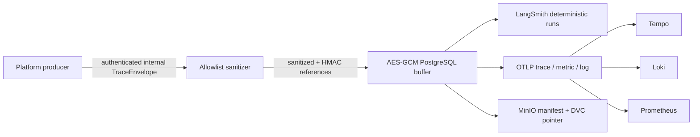

# I-0013 Sanitized Trace Foundation Runbook

## 1. 目标与边界

本 Runbook 覆盖 `TraceEnvelope` 从受信任进程进入私有 Trace Service，到 LangSmith、OTLP/Tempo/Loki/Prometheus 和 MinIO 证据归档的完整路径。I-0013 只建立平台 Trace 地基，不实现或声称 Agent 推理、Tool、RAG、Action 等尚未发生的业务阶段。

任何原始 prompt、模型私有推理、身份、租户 ID、服务器定位信息、凭据、HTTP body 或任意未登记属性，都不得进入缓冲、日志、Trace 后端和证据对象。拒绝发生在持久化之前，拒绝内容本身不写入诊断日志。

## 2. 数据流与信任边界



Trace Service 仅通过 `ClusterIP` 暴露在 `fw-control`。入口令牌、LangSmith key、PostgreSQL/MinIO 凭据、两把 32-byte Trace key 只存在于仓库外加密存储或 Kubernetes Secret。Pod 禁用 ServiceAccount token、特权提升和可写根文件系统。

## 3. 固定状态语义

每个 sanitized trace 对 `langsmith`、`otlp`、`archive` 分别维护 delivery：

```text
PENDING -> LEASED -> ACKED
             |
             +---- lease expiry / retryable or unknown failure -> PENDING
```

- `trace_ref + payload_digest` 保证同一 Trace 的幂等内容；同 ref 不同 digest fail closed。
- 缓冲达到固定容量时拒绝新 Trace，不静默丢弃最旧记录。
- 每个后端使用由受密钥保护的 HMAC 生成的确定性 ID。未知 ACK 后重放仍使用同一远端 ID；LangSmith `409` 必须读取既有 run 并核对 `payload_digest`，冲突不可覆盖。
- 只有三个 delivery 都 `ACKED`，Trace 才计为已清空。Gate candidate 结束时 `pending_traces` 必须为 `0`。
- PostgreSQL 只保存 AES-GCM ciphertext、nonce、key ID、digest、候选 SHA 和 delivery 元数据，不保存可读 Trace payload。

## 4. 脱敏规则

Span name 必须匹配固定 stage 前缀；属性必须来自代码内明确 allowlist 且为 256 字符以内的 scalar。以下任一情况拒绝整个 Trace：

- 未登记属性或 stage/name 不一致；
- 多 root、孤儿 parent、环、重复 Span ID 或未结束 Span；
- Secret/API key/Bearer/私钥、电子邮件、IP、canary 或 private-reasoning 模式；
- 嵌套对象、原始请求/响应、prompt、用户或服务器字段。

租户、Incident、Task、Action、Correlation 和 Causation 标识经过 HMAC 后才允许离开进程。公开报告只保留 sanitized ref、完整 candidate SHA、计数、digest 和受控私有 evidence reference。

## 5. 部署与检查

实现提交形成完整候选后执行：

```powershell
$candidate = git rev-parse HEAD
uv run python -m faultwitness_dev deploy-runtime-schema --candidate-sha $candidate
uv run python -m faultwitness_dev deploy-platform --candidate-sha $candidate
uv run python -m faultwitness_dev deploy-trace-service --candidate-sha $candidate
uv run python -m faultwitness_dev inspect-trace-service --candidate-sha $candidate
uv run python -m faultwitness_dev smoke-trace-service --candidate-sha $candidate
```

`deploy-platform` 更新 OTel Collector 的三条 pipeline：Trace 到 Tempo、Log 到 Loki、Metric 到 Prometheus。`deploy-trace-service` 从仓库外加密存储读取 LangSmith key，经受控 stdin/API 创建 Kubernetes Secret；不打印 key、suffix 或可逆指纹。

部署成功必须同时满足：候选绑定匹配完整 SHA、Deployment `1/1 Ready`、Service 为 `ClusterIP`、readiness 查询成功、数据库 migration `003_i0013` 存在。

## 6. 故障处理

- Sanitizer 拒绝：返回通用 `422`；不得记录被拒 payload。
- Buffer 满：返回 `503` 并停止接收；先恢复后端并 drain，不提高容量掩盖泄漏。
- LangSmith/OTLP/MinIO timeout、断连或可重试状态：delivery 回到 `PENDING`，指数退避后按同一远端 ID 重放。
- 永久 4xx、LangSmith 既有 run digest 冲突、OTLP partial rejection：保留 pending evidence，停止 Gate closure，修复后生成新候选。
- 数据库不可用或密钥不匹配：readiness 失败；不切换到内存缓冲。
- 诊断命令仅输出 Pod 状态和已脱敏日志：

```powershell
uv run python -m faultwitness_dev diagnose-trace-service
```

## 7. Eval 与关闭条件

实现检查点 smoke 必须证明：合法 Trace 三后端 drain 为零、重复提交返回同一结果、Secret canary 在持久化前被拒。完整 EVAL-G01-007 仍需在同一不可变候选上执行后端 outage/recovery、全表面 canary scan、LangSmith/Tempo/Loki/Prometheus/MinIO 关联查询、重复/丢失核对和独立 wall-time reconciliation。

完整通过标准保持冻结：missing span、canary hit、rejected-payload egress、duplicate/lost replay 均为 `0`；每个 root 的时间误差不超过 `max(50 ms, 5%)`；candidate 结束时 pending production Trace 为 `0`，LangSmith base trace 不超过 `1,500`。
