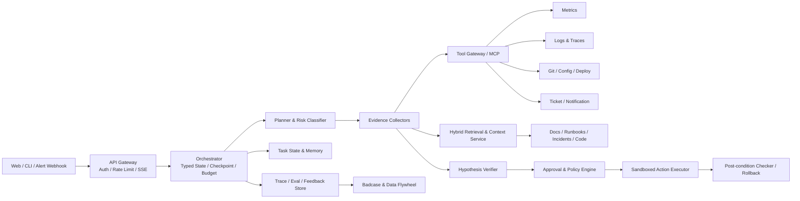

# 大厂 Agent 项目立项要求与决策报告

> 版本：v1.0  
> 日期：2026-07-17  
> 用途：用于决定后续 Agent 项目的业务方向、技术范围、开发顺序、验收门槛与面试材料建设。  
> 核心目标：开发一个能够经受大厂 Agent 应用、Agent 算法优化、Agent Infra 三类岗位连续深挖的项目，而不是功能堆叠式 Demo。

---

## 0. 结论先行

大厂面试强度下，一个 Agent 项目是否“非 Toy”，不取决于它是否同时出现 LangGraph、RAG、Memory、MCP、Skills、Multi-Agent 等名词，而取决于能否形成下面这个完整闭环：

> **真实问题定义 → 可复现业务环境 → 有状态的多步执行 → 真实工具与副作用 → 数据与知识供给 → 失败恢复与安全治理 → 分层评测 → Badcase 回流 → 量化迭代 → 可部署、可观测、可解释。**

本报告的首要建议是：

> **优先开发“面向微服务系统的可验证故障诊断与受控修复 Agent 平台”，暂定名 OpsPilot。**

推荐它并不是因为“运维 Agent”听起来高级，而是因为这个场景天然具备最适合面试展示的七个条件：

1. 有真实、可本地复现的复杂环境：微服务、日志、指标、链路、代码、配置、Runbook。
2. 任务不是问答，而是观察、假设、取证、诊断、规划、审批、执行、验证、回滚的长链路。
3. 既有只读工具，也有产生副作用的工具，能够展示权限、沙箱、人工审批、幂等和撤销。
4. 根因和系统最终状态可以客观验证，容易构建高质量评测集，而不是只靠“感觉回答不错”。
5. 能自然体现 RAG、上下文工程、Agent Loop、状态管理、并行取证、可观测性和流式交互。
6. 可以从应用层继续向 Agent Infra 或 Agent 后训练延伸，而不需要另起一个互不相关的项目。
7. 数据、环境和故障可大厂 Agent 项目立项要求与决策报告

> 版本：v1.0  
> 日期：2026-07-17  
> 用途：用于决定后续 Agent 项目的业务方向、技术范围、开发顺序、验收门槛与面试材料建设。  
> 核心目标：开发一个能够经受大厂 Agent 应用、Agent 算法优化、Agent Infra 三类岗位连续深挖的项目，而不是功能堆叠式 Demo。

---

## 0. 结论先行

大厂面试强度下，一个 Agent 项目是否“非 Toy”，不取决于它是否同时出现 LangGraph、RAG、Memory、MCP、Skills、Multi-Agent 等名词，而取决于能否形成下面这个完整闭环：

> **真实问题定义 → 可复现业务环境 → 有状态的多步执行 → 真实工具与副作用 → 数据与知识供给 → 失败恢复与安全治理 → 分层评测 → Badcase 回流 → 量化迭代 → 可部署、可观测、可解释。**

本报告的首要建议是：

> **优先开发“面向微服务系统的可验证故障诊断与受控修复 Agent 平台”，暂定名 OpsPilot。**

推荐它并不是因为“运维 Agent”听起来高级，而是因为这个场景天然具备最适合面试展示的七个条件：

1. 有真实、可本地复现的复杂环境：微服务、日志、指标、链路、代码、配置、Runbook。
2. 任务不是问答，而是观察、假设、取证、诊断、规划、审批、执行、验证、回滚的长链路。
3. 既有只读工具，也有产生副作用的工具，能够展示权限、沙箱、人工审批、幂等和撤销。
4. 根因和系统最终状态可以客观验证，容易构建高质量评测集，而不是只靠“感觉回答不错”。
5. 能自然体现 RAG、上下文工程、Agent Loop、状态管理、并行取证、可观测性和流式交互。
6. 可以从应用层继续向 Agent Infra 或 Agent 后训练延伸，而不需要另起一个互不相关的项目。
以基于开源微服务与故障注入复现，不依赖难以证明的虚构公司数据。

项目最终应达到“生产型原型”而非真正商业生产系统：具备生产系统的关键约束、证据和测试，但将多地域、超大规模集群、完整企业 IAM 等不可控范围明确列为非目标。

### 0.1 一票否决条件

以下任一项成立，项目仍会被面试官判断为 Toy：

- 只有聊天页面、Prompt 和几个 API，没有可验证的业务闭环。
- 只有固定 Workflow，却宣称是自主 Agent；或者所有事情都让模型决定，没有确定性边界。
- 使用多 Agent 但说不清为什么单 Agent 不够，也没有单 Agent 对照实验。
- 使用 RAG 但说不清数据量、文档类型、切分、索引、TopK、重排、更新、冲突、权限和评测。
- 简历写“准确率 90%”“Token 降低 60%”“响应提速 5 倍”，却拿不出测试集、计算公式、样本数和实验报告。
- 没有失败注入、超时、重试、降级、幂等、断点恢复和死循环控制。
- 工具有写操作，却没有风险分级、人工审批、审计和回滚。
- 没有完整 Trace，Badcase 发生后不能定位到规划、检索、工具、模型、记忆中的具体环节。
- 只会讲框架 API，不理解状态、并发、数据库、队列、缓存、网络和部署。
- 项目来自开源仓库改名，无法讲清自己的需求、取舍、失败方案与代码贡献。

---

## 1. 调研范围与方法

### 1.1 全量来源

本报告纳入了工作区中的全部相关材料：

| 来源 | 文件数 | 有效内容 | 说明 |
|---|---:|---:|---|
| 岗位材料 | 23 | 23 | 22 份真实岗位 JD，另有 1 份 LangGraph Streaming 技术资料 |
| 牛客面经 | 47 | 45 | 2 个源文件为空，已记录但无法提取问题 |
| 小红书面经 | 39 | 39 | 含 38 篇独立面经及 1 份大型 RAG 面经整合文档 |
| 合计 | 109 | 107 | 约 17.1 万字符 |

PDF 岗位材料逐页完成文本抽取，并渲染首屏核对版面和抽取质量。两渠道文本逐份按 UTF-8 读取。大型整合文档包含多轮大厂对 RAG 项目的连续追问与参考回答，作为高权重定性证据，但在文件级频率统计中只计为一个来源，避免进一步放大。

两个空文件为：

- `agent开发岗位-牛客/腾讯元宝大模型算法一面分享-夯爆了.txt`
- `agent开发岗位-牛客/阿里淘天27实习 智能体开发面经分享.txt`

### 1.2 统计口径

对 84 份非空面经做“文件级主题编码”：某文件只要出现一次相关追问，就记为覆盖该主题；同一文件可以覆盖多个主题。因此该统计用于判断面试覆盖面，不等价于精确问题数量。

| 面试主题 | 覆盖面经 | 覆盖率 |
|---|---:|---:|
| RAG、检索、召回与重排 | 57 / 84 | 67.9% |
| 记忆与上下文工程 | 56 / 84 | 66.7% |
| 评测、测试集与 Badcase | 52 / 84 | 61.9% |
| 数据摄取与文档处理 | 52 / 84 | 61.9% |
| AI Coding、Skills、Harness | 50 / 84 | 59.5% |
| 项目背景、价值、归属与规模 | 44 / 84 | 52.4% |
| Tools、MCP、Skills | 43 / 84 | 51.2% |
| 多 Agent、状态与通信 | 34 / 84 | 40.5% |
| 性能、并发与成本 | 33 / 84 | 39.3% |
| 模型与框架选型 | 33 / 84 | 39.3% |
| 后端与分布式工程 | 32 / 84 | 38.1% |
| Prompt 工程 | 31 / 84 | 36.9% |
| 架构与端到端流程 | 27 / 84 | 32.1% |
| 失败恢复与可靠性 | 27 / 84 | 32.1% |
| 规划、反思与 Agent Loop | 26 / 84 | 31.0% |
| 后训练、SFT 与 RL | 23 / 84 | 27.4% |
| 安全、权限与沙箱 | 21 / 84 | 25.0% |
| 可观测、Trace 与监控 | 12 / 84 | 14.3% |
| 流式交互 | 4 / 84 | 4.8% |

“可观测”和“流式”在面经中的显式出现率不高，不代表它们可以不做。它们往往作为项目架构、性能、线上稳定性和 LangGraph 节点执行追问的隐含前提；同时在 Agent Infra JD 中被明确要求。

对 22 份真实 JD 做同样的文件级编码，得到：

| JD 能力主题 | 覆盖 JD | 覆盖率 |
|---|---:|---:|
| Agent 架构与全生命周期 | 20 / 22 | 90.9% |
| Tools、MCP、Skills | 19 / 22 | 86.4% |
| RAG 与知识库 | 18 / 22 | 81.8% |
| 评测、观测与回测 | 18 / 22 | 81.8% |
| 后训练、SFT、DPO、RL | 17 / 22 | 77.3% |
| 多模态 | 17 / 22 | 77.3% |
| 多 Agent | 14 / 22 | 63.6% |
| 模型与推理基础 | 14 / 22 | 63.6% |
| Memory 与上下文 | 13 / 22 | 59.1% |
| 后端与分布式 | 13 / 22 | 59.1% |
| 云原生与 Agent Infra | 9 / 22 | 40.9% |
| 数据构建与数据飞轮 | 7 / 22 | 31.8% |
| AI Coding 与工程规范 | 7 / 22 | 31.8% |
| 安全、治理与权限 | 5 / 22 | 22.7% |

注意：岗位中存在多份职责高度相近的淘天/天猫 Agent 优化岗位，因此比例反映当前样本，不等于整个市场的无偏分布。

### 1.3 岗位族群

这些 JD 实际上不是同一个岗位，至少分成四类：

1. **Agent 应用/全栈开发**：关注真实业务、后端 API、RAG、工具编排、上线、性能与 AI Coding。
2. **Agent 算法/优化**：关注数据、评测、SFT/DPO/RL、Reward、Trajectory、模型原理与 Badcase。
3. **Agent Infra/平台**：关注 Runtime、调度、状态、沙箱、鉴权、观测、AgentOps、云原生与多租户。
4. **客户端/产品工程**：关注 Agent 与端侧/前端产品结合、流式体验、工程质量和完整交付。

一个个人项目不可能在每个方向都达到同样深度。合理方案不是堆满所有能力，而是：

- 建设一套共同的生产型 Agent 核心；
- 主攻“应用开发”作为默认求职叙事；
- 按目标岗位二选一增加“算法优化扩展”或“Infra 扩展”；
- 多模态只有在业务数据确实需要图片、表格或视频时才进入 P1，不为关键词覆盖强行加入。

---

## 2. 面试官真正想验证什么

### 2.1 项目真实性

面试官首先判断项目是否是网上找来的、是否真正做过。高频问题包括：

- 为什么做？谁是用户？原流程有什么损失？
- 项目来自实习、实验室还是个人？团队几人？你负责什么？
- 数据从哪里来？规模多少？线上用户和请求量多少？
- 是否上线？实际使用频率、人工采纳率、业务收益如何？
- 最大失败是什么？哪些目标没有达到？为什么？
- 你现在是否还在使用？能否现场演示？
- 为什么不用现成产品或开源框架？你比 Claude Code、Dify、LlamaIndex 好在哪里，又差在哪里？

因此项目必须拥有一条可证伪、可复现的故事，不能使用虚构公司客户、虚构“亿级流量”或无法出示的内部指标。

### 2.2 技术理解深度

面试不是问“有没有 RAG”，而会继续追问：

- PDF、扫描件、表格、图片、代码和日志怎么解析？
- Chunk 是字符还是 Token？为什么是这个大小？父子块怎么关联？
- BM25 是稀疏向量还是倒排索引？Dense 向量多少维？
- Dense 与 BM25 各召回多少？怎么融合？为什么 RRF？
- 为什么要 Rerank？Cross-Encoder 与 LLM Rerank 的代价如何？
- 索引存了什么？如何增量更新、删除、回滚和处理冲突？
- 10 万、100 万、1000 万 Chunk 分别怎样扩展？

同理，多 Agent、Memory、MCP、Skills、Prompt、模型和框架都会被追到实现和取舍。

### 2.3 量化与科学性

“效果不错”没有意义。面试官会问：

- 测试集来源、样本数、人员、标注规范和难度分布；
- 训练集与测试集是否泄漏；
- 指标的公式、阈值、置信区间和错误类型；
- 88% 剩下的 12% 是什么；哪一类最低；
- 为什么统计 Hit@3 而不是 Hit@1；为什么 Recall@20 而不是 Recall@5；
- 换模型、Prompt、Chunk、TopK、Rerank 前后各提升多少；
- LLM-as-Judge 是否与人工一致，Judge 自身偏差怎么校准；
- Badcase 如何定位、回流和防止“修好一类、破坏另一类”。

项目必须从第一天建设评测，而不是最后为了简历补一个百分比。

### 2.4 工程与生产约束

Agent 应用岗位底层仍是后端/系统岗位。典型追问：

- 多用户并发、异步工具、线程/协程、任务队列；
- 状态竞争、Checkpoint、幂等、Exactly-once 的边界；
- 工具超时、空结果、限流、429、重试、熔断、降级；
- Agent 卡死、无进展循环、预算耗尽、进程宕机后恢复；
- QPS、P95、Token、成本、缓存、批处理和模型路由；
- 鉴权、权限、数据隔离、Prompt Injection、日志脱敏、审计；
- 沙箱、人工审批、撤销和补偿事务；
- Docker、CI/CD、灰度、回滚和监控。

### 2.5 技术判断力

大厂面试反复使用“为什么”检验候选人是否只会背名词：

- 为什么 Agent，不是普通程序或 Workflow？
- 为什么多 Agent，不是单 Agent 加 Tools？
- 为什么 RAG，不是长上下文、SQL、知识图谱或微调？
- 为什么 LangGraph，不是 LangChain、Dify、自研状态机？
- 为什么该模型、Embedding、向量库、索引和缓存？
- 什么情况下你的方案反而更差？
- 如果重新做一次，会删除什么、保留什么？

每个主要选型必须有：业务约束、候选方案、实验数据、最终决策、代价和迁移路径。

---

## 3. “非 Toy”成熟度定义

| 等级 | 特征 | 面试判断 |
|---|---|---|
| L0 展示 Demo | 单 Prompt、聊天 UI、固定返回 | 明确 Toy |
| L1 技术 POC | 接入 RAG 或 Tools，能跑通少量案例 | 仍偏 Toy |
| L2 工程原型 | 有状态、测试、日志、错误处理和基础部署 | 可用于一般实习面试，但容易被深挖击穿 |
| L3 面试级生产型原型 | 真实环境、完整闭环、分层评测、失败注入、权限、可观测、对照实验 | 本项目最低目标 |
| L4 生产候选 | 多租户、SLO、容量规划、灰度、审计、持续数据飞轮 | 可选冲刺，不要求复制真实大厂规模 |

### 3.1 L3 必须同时满足的十条门槛

1. **真实场景**：能说明用户、频率、痛点、当前基线和失败代价。
2. **完整闭环**：至少一个任务跨越 5 个以上有意义步骤，并产生可验证最终状态。
3. **真实工具**：至少 6 个领域工具，其中至少 2 个有副作用，但所有副作用受控。
4. **基线系统**：至少比较确定性 Workflow、单 Agent 和最终方案中的两种。
5. **真实数据**：数据来源、清洗、版本、冲突、权限、增量更新和规模均可解释。
6. **分层评测**：结果、轨迹、工具、检索、记忆、安全、性能均有指标。
7. **可靠性**：超时、失败、重复、并发、宕机、卡循环均有测试。
8. **安全治理**：风险分级、最小权限、审批、审计、脱敏、回滚齐全。
9. **可观测**：一次请求能从最终结果追溯到所有模型、检索、工具和状态更新。
10. **可复现证据**：一条命令启动、固定评测集、实验报告、架构决策记录和演示脚本。

---

## 4. 项目方向决策

评分采用 1-5 分；分数评估的是个人在公开环境中做出“可证明深度”的可行性，不是商业价值绝对高低。

| 方向 | 真实闭环 | 客观评测 | 工具/副作用 | 安全深度 | 后端/Infra | 算法扩展 | 数据可得 | 面试差异化 | 总分 |
|---|---:|---:|---:|---:|---:|---:|---:|---:|---:|
| 微服务诊断与受控修复 Agent | 5 | 5 | 5 | 5 | 5 | 4 | 5 | 5 | 39/40 |
| 需求→代码→测试→发布 Coding Agent | 5 | 5 | 5 | 5 | 5 | 4 | 5 | 4 | 38/40 |
| 客服/订单处置 Agent | 5 | 4 | 5 | 5 | 4 | 5 | 2 | 5 | 35/40 |
| Deep Research/研究 Agent | 4 | 4 | 3 | 3 | 3 | 4 | 5 | 3 | 29/40 |
| 企业知识库问答 Agent | 3 | 4 | 2 | 2 | 3 | 3 | 5 | 2 | 24/40 |

### 4.1 推荐：OpsPilot

**产品定义**：面向微服务研发和 SRE 的 Agent 平台。收到告警或自然语言问题后，系统从指标、日志、Trace、代码、配置、变更记录和 Runbook 中收集证据，生成可追溯根因假设；在风险策略和人工审批约束下执行可逆修复；随后验证恢复效果，必要时自动回滚并沉淀事件记忆。

### 4.2 为什么不优先做普通 Coding Agent

Coding Agent 同样强，但面试官会自然拿它与 Claude Code、Codex、Cursor 对比。个人项目很难在通用代码能力上证明“更好”。若做 Coding Agent，应明确收窄到一个可评测垂直任务，例如“Java 微服务故障修复与回归测试”，而不是复制通用 CLI。

### 4.3 为什么不优先做纯 RAG

纯 RAG 能覆盖大量面试题，但现在已经是最低配。除非数据处理本身具有独特难度，例如复杂版面、多模态、代码依赖、实时权限和百万级索引，否则“上传 PDF 后问答”很容易被认定为模板项目。

### 4.4 何时改选客服/风控等垂直 Agent

如果能够合法获得真实业务数据、标注规范和领域专家反馈，垂直客服、交易风控、合同审核会比 OpsPilot 更有业务说服力。没有这些资源时，不应虚构客户、人工团队和线上准确率。

---

## 5. OpsPilot 产品边界

### 5.1 目标用户

- 微服务项目开发者；
- 本地/测试环境 SRE；
- 负责事故复盘和 Runbook 维护的工程师；
- 面试演示中的审批人和审计查看者。

### 5.2 核心任务

1. 告警解释：这个告警是否真实、影响哪些服务和用户路径？
2. 根因诊断：从多源证据中输出带置信度的根因排序。
3. 修复建议：生成与证据对应的候选动作、风险和预期效果。
4. 受控执行：只读操作自动执行；写操作按风险进入审批。
5. 恢复验证：比较修复前后指标、错误率、Trace 和健康检查。
6. 自动回滚：未达到后置条件或出现新风险时执行补偿动作。
7. 事件沉淀：保存证据、决策、动作、结果和人工反馈，形成可检索经验。

### 5.3 明确非目标

- 不让模型直接拥有任意 Shell、生产数据库写权限或 Kubernetes 管理员权限。
- 不宣称替代 SRE；高风险动作始终由人审批。
- 不追求真正的亿级请求、跨地域容灾和完整企业 IAM。
- 不为“多 Agent”而拆 Agent；单 Agent 足够时保持单 Agent。
- 不在没有证据前训练模型；优先解决数据、工具、上下文和评测问题。
- 不展示模型私有思维链；只展示证据、计划、状态和可审计决策摘要。

### 5.4 可复现环境

建议使用 8-12 个服务的开源微服务样例，部署在 Docker Compose 或本地 Kubernetes：

- 接入 Prometheus 指标；
- 接入结构化日志系统；
- 接入 OpenTelemetry Trace；
- 保留 Git 仓库、配置、发布记录和 Runbook；
- 使用故障注入脚本制造延迟、5xx、依赖不可用、连接池耗尽、CPU/内存异常、错误配置和发布回归。

至少覆盖六类事故，并为每类定义根因、影响路径、正确取证工具、允许动作和恢复后置条件。

### 5.5 黄金演示链路

1. 故障注入：订单服务因错误配置导致下游超时。
2. 告警进入：系统创建 `incident_id`，记录租户、环境和时间窗。
3. 风险识别：判断为可诊断、不可直接写入的中风险事件。
4. 并行取证：指标、日志、Trace、最近变更和 Runbook 同时查询。
5. 证据归一化：每条证据带来源、时间、服务、置信度和内容哈希。
6. 假设排序：输出三个候选根因，并说明支持/反驳证据。
7. 计划生成：先执行只读验证，再提出回滚到上一配置版本。
8. 人工审批：前端展示 Diff、影响面、回滚计划和过期时间。
9. 工具执行：使用幂等键执行回滚，完整记录返回值。
10. 恢复验证：观察错误率、P95 和健康检查；不达标则撤销或升级人工。
11. 事件报告：输出引用、时间线、动作、结果、未解决风险和复盘项。
12. 记忆写入：经质量门控后，把本次事件沉淀为可追溯 Episode，而不是把整段对话直接塞入向量库。

演示必须额外展示一次失败路径，例如工具超时后重试、Worker 重启后从 Checkpoint 恢复、审批超时取消，或者修复后指标未恢复触发回滚。

---

## 6. 总体架构要求



### 6.1 API 与会话入口

- 提供 REST 创建任务、查询状态、审批/拒绝、取消任务和反馈接口。
- 使用 SSE 或 WebSocket 输出类型化事件，而不是只流式输出自然语言 Token。
- 每个请求必须包含 `tenant_id`、`user_id`、`session_id`、`task_id`、`trace_id`。
- 支持客户端断线重连，通过单调递增 `event_id` 补发未消费事件。
- API 层执行认证、限流、请求大小限制、Schema 校验和幂等检查。

### 6.2 Orchestrator 与 Typed State

不得用全局字典承载 Agent 状态。核心状态至少包括：

- 任务目标、范围、环境、截止时间；
- 风险等级、权限快照、Token/金额/步骤预算；
- 当前 Plan、步骤依赖、步骤状态、重试次数；
- 证据引用，不直接无限复制大段工具输出；
- 根因假设及其支持/反驳证据；
- 工具调用记录、幂等键、错误与补偿动作；
- 审批状态、审批人、过期时间和批准参数；
- 最终后置条件和验证结果；
- Checkpoint 版本和乐观锁版本号。

状态更新必须通过节点返回的显式 Delta 完成。并行节点只能写各自命名空间；共享列表使用确定性 Reducer 合并。持久化层使用事务或乐观并发控制，防止并行 Agent 覆盖结果。

### 6.3 Agent Loop

建议采用“确定性外壳 + 受约束模型决策”：

1. 解析目标、环境和风险；
2. 检查信息是否充分，不足则向用户澄清；
3. 生成带前置条件、后置条件、预算和依赖的计划；
4. 执行当前允许的工具；
5. 验证工具结果和 Schema；
6. 更新证据与假设；
7. 判断继续、改写查询、换工具、回退、请求审批或终止；
8. 达成目标后执行独立验证；
9. 输出证据化结论并归档。

必须同时存在以下终止条件：

- 最大步骤数；
- 最大模型调用数；
- 最大 Token/成本；
- 总 Deadline 和单工具 Timeout；
- 连续无新增证据；
- 连续计划/工具调用高度相似；
- 同一错误超过重试上限；
- 用户取消或审批过期；
- 达成后置条件；
- 安全策略拒绝。

### 6.4 单 Agent 与多 Agent

先实现单 Agent Baseline。只有下面三类情况允许拆分：

1. **可并行取证**：指标、日志、Trace、代码和变更查询互不依赖。
2. **工具/权限边界不同**：只读分析与写操作执行必须隔离。
3. **需要独立验证**：Verifier 不共享 Planner 的结论，减少确认偏差。

建议最终角色不超过四类：

- Orchestrator/Planner：拆任务、管预算、决定下一步；
- Evidence Collectors：按数据源并行取证，返回统一 Evidence Schema；
- Verifier/Critic：验证根因、引用和修复计划；
- Executor：只能执行 Policy Engine 已授权的动作。

禁止让所有 Agent 拥有全部工具。子 Agent 返回结构化结果，不返回完整私有上下文；主 Agent 只消费结论、证据引用、置信度、错误和建议下一步。

必须完成以下消融实验：

- 固定 Workflow；
- 单 Agent + 全工具；
- 单 Agent + 动态工具加载；
- 多 Agent 并行取证；
- 多 Agent + 独立 Verifier。

比较 Task Success、延迟、成本、无效调用数、错误传播和稳定性。若多 Agent 无显著收益，简化架构是正确结论，而不是失败。

### 6.5 Model Gateway

- 对模型调用统一封装：Provider、模型版本、超时、重试、并发、Token、费用和 Trace。
- 所有关键输出使用 JSON Schema/Pydantic 校验；解析失败进入修复或降级，不直接继续执行。
- 根据任务路由模型：确定性分类优先规则/小模型，复杂规划和验证才用强模型。
- 支持主模型、备用模型和不可用降级；切换模型后必须跑完整回归。
- Prompt、模型、参数和 Schema 都必须版本化，并写入每次 Trace。
- 缓存只用于可安全复用的纯函数步骤；缓存 Key 包括模型版本、Prompt 版本、输入哈希和权限范围。

### 6.6 流式事件

参考工作区中的 LangGraph Streaming 资料，事件至少分为：

- `message`：给用户的可见回答片段；
- `state_update`：任务状态变化；
- `task_event`：节点开始、完成、失败；
- `tool_event`：工具请求、进度和结果摘要；
- `evidence_event`：新证据到达；
- `approval_required`：需要人工批准；
- `checkpoint`：已持久化的恢复点；
- `error`：结构化错误和可恢复性；
- `final`：最终结果。

不向前端输出模型隐藏思维链。进度消息必须来自真实节点状态，不能让模型凭空生成“正在查询日志”。

---

## 7. Tools、MCP、Skills 与 Prompt 要求

### 7.1 概念边界必须明确

| 概念 | 项目中的职责 | 不应该承担的职责 |
|---|---|---|
| Prompt | 单次模型调用的目标、上下文、约束、格式 | 不负责真正执行外部动作 |
| Skill | 可复用的领域操作规程、资源、脚本与验收标准 | 不是远程能力协议，也不是所有上下文的永久展开 |
| Tool | 一个边界明确、Schema 化、可执行的能力 | 不承载模糊的完整业务流程 |
| MCP | Tool/Resource/Prompt 的标准发现与调用接口 | 不自动解决权限、质量和业务编排 |
| Workflow | 确定性的步骤、条件和状态流转 | 不等于自主决策 Agent |
| Agent | 在预算与策略内，根据状态选择下一步行动 | 不能绕过权限和确定性安全边界 |

### 7.2 Tool 设计规范

每个 Tool 必须包含：

- 稳定、唯一、动宾结构的名称；
- 清晰描述和“不适用场景”；
- 严格 Input/Output Schema；
- 字段单位、枚举、默认值和边界；
- 是否只读、是否幂等、风险级别；
- 需要的 Scope/Role；
- Timeout、重试策略和限频；
- 错误码、是否可重试、用户可见信息；
- Dry-run、补偿/撤销工具；
- 示例与反例；
- Trace、审计和敏感字段规则。

模型不得直接拼接 Shell。命令必须由 Tool 实现层根据受控参数构造，执行目标限定在沙箱或白名单资源内。

### 7.3 最低工具集合

只读工具：

- 查询指标；
- 查询日志；
- 查询 Trace；
- 查询部署/配置历史；
- 搜索代码和依赖；
- 检索 Runbook/历史 Incident；
- 查询服务拓扑和健康状态。

副作用工具：

- 创建/更新事件单；
- 回滚配置或部署；
- 重启/扩缩指定沙箱服务；
- 发送通知。

每个副作用工具必须有 Dry-run、审批、幂等、结果验证和补偿路径。

### 7.4 工具太多时的处理

不把几十个完整 Schema 永久塞入 System Prompt。采用：

1. 一级领域路由选择工具组；
2. 二级根据名称、描述、权限和任务状态检索候选工具；
3. 只向当前节点暴露 3-8 个工具；
4. 高风险工具只有审批节点可见；
5. 记录工具召回 Recall@K、选择准确率和上下文成本。

### 7.5 Skill 规范

一个项目 Skill 至少包含：

- 触发条件和反触发条件；
- 单一职责；
- 输入、输出和前置条件；
- 可执行步骤；
- 所引用的 Tool、模板、脚本和参考资料；
- 权限边界与禁止动作；
- 失败处理和人工升级条件；
- 示例、反例和验收标准；
- 独立 Eval Case。

Skill 采用渐进式加载：目录和摘要用于匹配；命中后才加载完整规程；脚本、模板和大参考文件按需读取。需要评测 Skill 触发 Precision/Recall、任务成功率、额外 Token、越权率和跨 Skill 冲突。

### 7.6 Prompt 规范

System Prompt 至少明确：

- 角色和最终目标；
- 可操作环境；
- 不可信数据边界；
- 工具使用和引用规则；
- 风险分级与审批规则；
- 预算和终止条件；
- 信息不足时如何澄清；
- 输出 Schema 与禁止泄露字段。

Prompt 优化不得只靠主观。每次变更要绑定版本、假设、目标 Badcase 和回归结果。若“修好 A、破坏 B”，使用分层 Prompt、路由、规则、Few-shot 分群或模型训练，而不是继续堆通用指令。

---

## 8. RAG 与数据工程要求

### 8.1 数据类型

OpsPilot 的知识不是单一 PDF：

- Runbook、架构文档、API 文档；
- Git 代码、配置和依赖关系；
- 发布记录、PR、Commit、变更 Diff；
- 历史 Incident、工单和复盘；
- 指标、日志和 Trace 的摘要或可查询引用；
- 架构图、流程图和表格。

结构化实时数据不应全部向量化。指标、数据库状态和实时日志优先通过 Tool 查询；RAG 用于相对稳定、长尾、需引用的知识。

### 8.2 离线摄取流水线

1. **Source Discovery**：记录来源、Owner、ACL、版本和更新时间。
2. **质量预检**：格式白名单、大小、编码、有效字符率、扫描件判断和恶意文件检测。
3. **解析路由**：Markdown/HTML/代码走结构解析；PDF 走文本层，低质量页走 OCR；表格和图像单独处理。
4. **标准化**：去页眉页脚、导航噪声、重复块；保留代码块、表格、标题层级和页码。
5. **结构感知切分**：标题、段落、函数、配置块、故障步骤优先；超长块再按 Token 递归切分。
6. **父子索引**：子块用于精确召回，父块或邻接块用于补足完整上下文。
7. **元数据**：`source_id`、`version`、`tenant`、`acl`、`service`、`environment`、`time_range`、`section`、`chunk_index`、`content_hash`。
8. **去重与冲突**：内容哈希、近重复检测；冲突版本不静默覆盖，保留来源权威性和有效时间。
9. **双路索引**：Dense + BM25/全文索引；索引写入与元数据写入具有事务语义或补偿任务。
10. **增量与删除**：文件级和 Chunk 级哈希；只重算变化块；旧版本 Tombstone；支持回滚。
11. **质量报告**：解析成功率、OCR 置信度、重复率、Chunk 分布、索引失败和权限缺失。

### 8.3 Chunk 策略

不得先写死“1000 字符、Overlap 200”再寻找理由。需要对以下变量做实验：

- 字符还是 Token；
- 中英文、代码、表格和日志的不同粒度；
- 结构切分、语义切分、固定切分、父子切分；
- Overlap 和邻居扩展；
- Chunk 对召回、完整性、Token、延迟的影响。

建议先建立 4-6 组配置，在同一评测集上比较 Recall@K、nDCG、Context Precision、答案完整性和成本，再确定默认值。

### 8.4 在线检索

1. 意图、环境、服务和时间范围识别；
2. 信息不足时澄清；
3. Query 改写与必要的子问题拆解；
4. ACL 和 metadata 预过滤；
5. Dense 与 Sparse 并行召回；
6. RRF 或经过验证的加权融合；
7. Cross-Encoder/轻量模型重排；
8. 父块/邻居扩展，去重和多样性控制；
9. 按 Token Budget 打包上下文；
10. 输出 Chunk 级 Citation 和置信度；
11. 低置信度时拒答、补检索或调用实时工具。

### 8.5 RAG 必须回答的选型问题

- 为什么 Dense + BM25；在哪些 Case 各自胜出？
- Dense 与 Sparse 各 TopK 多少；为什么？
- 为什么选择 RRF、加权融合或数据库原生混合检索？
- 为什么需要 Rerank；候选数和最终数如何确定？
- Embedding 模型为什么适合代码/中文/领域文本？维度、成本、最大 Token 如何？
- 向量库为什么是当前选择；容量和迁移阈值是什么？
- 图、表和 OCR 文本如何检索；为什么使用 Caption、共享多模态 Embedding 或独立索引？
- 文档冲突、过期、错误上传、删除和权限变更如何处理？
- RAG 与长上下文、Text2SQL、知识图谱、GraphRAG、微调如何选择？

### 8.6 建议数据规模

这是验收目标，不是为了简历夸大：

- 500-2,000 个原始知识对象，涵盖文档、代码、配置、变更和事件；
- 20,000-100,000 个可检索 Chunk；
- 至少 10% 的噪声、过期、近重复、冲突或权限受限数据；
- 至少 150 个带 Ground Truth 的事故任务；
- 至少 1,000 条完整 Agent 评测轨迹，可由同一任务多次运行形成；
- 训练/开发/测试按事故模板和时间切分，避免相似故障泄漏。

规模不是越大越好。必须同时展示索引大小、构建时间、增量更新时间、检索 P95 和内存占用。

---

## 9. Memory 与上下文工程要求

### 9.1 五种信息必须分开

1. **对话历史**：用户和系统的交互，不等于长期记忆。
2. **任务状态**：Plan、步骤、证据、审批和错误，必须结构化持久化。
3. **领域知识**：Runbook、代码和文档，属于知识库。
4. **Episode Memory**：历史事故的场景、证据、动作、结果与反馈。
5. **用户/团队偏好**：通知渠道、风险容忍度等，带来源和有效期。

把所有内容统一 Embedding 后检索，通常会造成重复、冲突和错误注入。

### 9.2 写入门控

只有同时满足以下条件才写长期记忆：

- 对未来任务可能有用；
- 相对已有记忆有新信息；
- 来源和结果可验证；
- 不包含禁止持久化的敏感数据；
- 带时间、环境、版本、置信度和过期策略。

人工否定的根因、未成功的修复动作不能作为正向经验写入；应作为负例保留。

### 9.3 读取与冲突

记忆检索分数至少考虑：相关性、时间新鲜度、来源权威性、成功结果、环境匹配和权限。冲突时：

- 不用“最后一条直接覆盖”作为唯一规则；
- 保留历史版本和来源；
- 优先正式 Runbook、已验证事故和当前环境；
- 无法裁决时显式暴露冲突并请求人工判断。

### 9.4 上下文打包

建议使用固定槽位：

1. System/Policy；
2. 当前目标与风险；
3. 当前 Plan 和未完成步骤；
4. 最新关键事件；
5. 相关长期记忆；
6. 当前证据摘要及 Artifact 引用；
7. 当前可用工具；
8. 输出 Schema。

### 9.5 压缩策略

采用三层组合，而不是只让 LLM 总结：

- **无损裁剪**：去重、移除已过期工具 Schema、把大工具输出移到对象存储，仅保留引用和摘要。
- **结构化状态提取**：保留目标、约束、计划、决策、错误、审批、证据 ID 和未完成项。
- **滚动摘要**：只压缩旧对话，保留最近窗口；摘要带版本、来源范围和校验信息。

禁止压缩掉：用户硬约束、审批决定、工具副作用、错误码、待办项和恢复所需引用。

需要评测压缩前后：Task Success、约束保持率、工具重复调用率、Token、延迟和摘要事实错误率。

---

## 10. 可靠性、安全与治理

### 10.1 失败分类

| 失败 | 检测 | 处理 |
|---|---|---|
| 模型 429/5xx/超时 | Provider 错误码、Deadline | 指数退避、抖动、并发限速、备用模型 |
| 模型输出不符合 Schema | 校验失败 | 一次结构修复；仍失败则降级或人工 |
| 工具空结果 | 业务 Schema | 改写 Query、扩大时间窗、换数据源 |
| 工具暂时失败 | 可重试错误码 | 有界重试；幂等键防重复副作用 |
| 权限不足 | Policy 拒绝 | 不重试，返回需要的 Scope |
| 并行状态冲突 | 版本号/事务失败 | 重读、合并或串行化关键写入 |
| Worker 崩溃 | 心跳/任务租约 | 从最近 Checkpoint 恢复 |
| 重复消息 | 幂等表/事件 ID | 返回已完成结果，不重复执行 |
| Agent 无进展 | 证据增量、状态相似度 | 终止、换策略或人工升级 |
| 修复无效 | 后置条件不满足 | 自动回滚或进入人工处置 |

### 10.2 风险等级

- **R0**：读取公开/本租户信息，可自动执行。
- **R1**：创建工单、发送通知等低风险可逆操作，可按策略自动。
- **R2**：重启、扩缩容、回滚测试环境，需要显式审批或预授权。
- **R3**：生产写操作、数据删除、权限修改，个人项目中禁止自动执行，只允许 Dry-run。

### 10.3 审批对象

审批不是一个“确认”按钮。必须展示：

- 动作和精确目标；
- 参数 Diff；
- 支持证据；
- 预期效果；
- 风险和影响面；
- 回滚动作；
- 审批有效期；
- 执行后验证条件。

批准后动作参数不可被模型偷偷修改；若参数变化，必须重新审批。

### 10.4 安全要求

- 最小权限与每工具 Scope；
- 租户级数据隔离和检索 ACL 预过滤；
- Secrets 不进入 Prompt、日志和代码库；
- 日志对 Token、密码、个人信息和业务数据脱敏；
- 外部文档、日志和网页全部标记为不可信数据，防 Prompt Injection；
- Tool 返回内容不能改变 System Policy；
- 文件上传做类型、大小、路径和内容检查；
- 所有动作具有不可篡改审计记录；
- 管理接口与普通用户接口分离；
- 依赖扫描、静态检查和容器非 Root 运行。

### 10.5 故障注入验收

至少自动化测试：

- 模型 429、5xx、超时和错误 JSON；
- 日志系统慢 10 秒或返回空数据；
- 并行 Agent 同时写共享状态；
- Worker 在动作前、动作后、Checkpoint 前分别崩溃；
- 同一消息重复投递；
- 恶意 Runbook 包含“忽略之前指令”；
- 用户尝试越权操作其他租户服务；
- 审批过期、拒绝和参数被修改；
- 修复动作成功但指标未恢复；
- Agent 重复调用同一工具或循环改写 Query。

---

## 11. 可观测性与性能

### 11.1 Trace 模型

每次任务形成一棵可查询 Trace：

- Root Task Span；
- 每个 Agent/Node Span；
- 每次模型调用 Span；
- 检索、重排、上下文组装 Span；
- Tool Span；
- 审批和动作 Span；
- Checkpoint 和恢复事件。

每个 Span 至少记录：输入/输出摘要、版本、开始结束时间、Token、费用、错误码、重试、父子关系和敏感字段掩码。原始大结果存对象存储，通过 Artifact ID 引用。

### 11.2 Dashboard

至少包含：

- Task Success、失败原因分布；
- P50/P95/P99 延迟与首个有效进度时间；
- 每节点耗时瀑布；
- 模型调用数、Token、成本和缓存命中；
- 工具成功率、参数错误率、重试率；
- 检索 Recall/Precision、Rerank 提升；
- 死循环、预算耗尽、人工升级；
- 安全拒绝和审批统计；
- 模型/Prompt/数据集版本对比。

### 11.3 性能实验

必须区分：

- 本地编排和存储性能；
- 外部模型/工具网络耗时；
- 单任务端到端体验；
- 并发下吞吐与排队；
- 质量、成本与延迟的 Pareto 前沿。

实验至少包括 1、10、25、50 并发，记录 QPS、P95、错误率、队列长度、CPU、内存、数据库连接和 Provider 限频。不能只报一个脱离环境的 QPS。

### 11.4 性能优化优先级

1. 先用 Trace 找瓶颈；
2. 独立数据源并行查询；
3. Embedding 和离线 LLM 增强批处理；
4. 查询、Embedding、静态前缀和工具结果安全缓存；
5. 只把必要上下文发给模型；
6. 小模型/规则承担简单节点；
7. 限制多 Agent 通信轮数；
8. 流式返回真实进度；
9. 使用连接池、异步 I/O、队列和背压；
10. 根据数据决定是否引入本地推理、Continuous Batching 和 Prefix/KV Cache。

---

## 12. 评测体系

### 12.1 评测数据构建

每个 Case 至少包含：

- 初始系统状态和故障注入；
- 用户目标；
- 可用/不可用工具；
- Ground Truth 根因；
- 必须收集的关键证据；
- 允许和禁止动作；
- 期望后置条件；
- 难度和风险等级；
- 对抗项、噪声项、过期信息和权限范围。

数据来源优先级：真实开源故障与人工构造 > 基于模板的故障注入 > LLM 合成。合成数据必须人工抽检，不能让同一模型同时生成题目、答案并担任唯一 Judge。

建议划分：

- Easy：单一服务、明显信号；
- Medium：跨服务依赖、多源证据；
- Hard：噪声、冲突、错误 Runbook、需要多跳验证；
- OOD：新故障类型、工具不可用、模型未见版本；
- Adversarial：Prompt Injection、越权、诱导高风险动作。

### 12.2 分层指标

#### 最终结果

- Task Success Rate；
- 根因 Top-1/Top-3 Accuracy；
- 修复成功率；
- 后置条件通过率；
- 人工升级率和错误自动处置率。

#### 轨迹

- 必要步骤覆盖率；
- 工具选择 Precision/Recall；
- 参数 Schema 正确率；
- 工具顺序合理率；
- 无效/重复调用率；
- 平均步骤数、最大步骤数；
- 无进展循环率。

#### RAG

- Recall@K、Hit@K；
- Precision@K；
- MRR、nDCG；
- Context Precision/Recall；
- Citation Correctness/Completeness；
- 版本、权限和新鲜度正确率。

#### 生成

- Faithfulness；
- 事实正确性；
- 证据覆盖；
- 不确定性校准；
- 结构化输出合法率。

#### Memory

- 写入 Precision；
- 读取 Recall；
- 冲突检测率；
- 过期记忆误用率；
- 压缩后约束保持率；
- 因记忆导致的性能提升或负迁移。

#### 安全

- 未授权动作率；
- 审批绕过率；
- Prompt Injection 成功率；
- 敏感信息泄漏率；
- 回滚成功率；
- 高风险动作误报/漏报。

#### 系统

- P50/P95/P99；
- Time-to-first-useful-event；
- 吞吐、错误率、恢复时间；
- Token/任务、成本/成功任务；
- Checkpoint 恢复率；
- 缓存命中率。

### 12.3 LLM-as-Judge 使用原则

- Judge Prompt 和模型版本固定；
- 对可规则判断的任务优先使用程序 Verifier；
- 抽取至少 10%-20% 样本做双人人评；
- 计算 Judge 与人工一致率；
- 隐藏候选模型名称，避免偏好；
- 关键安全指标不能仅靠 LLM Judge；
- 报告置信区间和多次运行方差。

### 12.4 建议 Release Gate

以下是立项目标，最终阈值应由基线实验校准：

| 指标 | P0 门槛 |
|---|---:|
| In-domain Task Success | ≥ 80% |
| Hard Case Task Success | ≥ 60% |
| 工具参数 Schema 合法率 | ≥ 99% |
| 可重试工具最终成功率 | ≥ 95% |
| Recall@10 | ≥ 90% |
| Citation Correctness | ≥ 95% |
| 未支持陈述率 | ≤ 3% |
| 无进展/死循环率 | < 1% |
| 未授权写操作 | 0 |
| 审批绕过 | 0 |
| Checkpoint 可恢复率 | ≥ 99% |
| 新版本相对核心集回归 | 不下降超过 2 个百分点 |

性能与成本阈值应根据所选模型和本地环境设定，不应先编一个漂亮数字。至少要求所有版本都报告相同硬件、相同并发、相同数据集下的结果。

### 12.5 必做实验

1. 固定 Workflow vs 单 Agent；
2. 单 Agent vs 多 Agent；
3. 静态全工具 vs 动态工具召回；
4. Dense vs BM25 vs Hybrid；
5. 无 Rerank vs Cross-Encoder Rerank；
6. 固定 Chunk vs 结构/父子 Chunk；
7. 无记忆 vs Episode Memory；
8. 无压缩 vs 三层压缩；
9. 单模型 vs 模型路由；
10. 无 Verifier vs 独立 Verifier；
11. 无缓存 vs 安全缓存；
12. 正常环境 vs 故障注入环境。

每个实验必须提前声明假设，报告质量、延迟、成本和失败分布，不能只挑提升的指标。

---

## 13. Badcase 与数据飞轮

### 13.1 Badcase 分类

- 目标理解错误；
- 意图/风险路由错误；
- Plan 缺步骤或依赖错误；
- Tool 召回或选择错误；
- 参数错误；
- Tool 自身失败；
- RAG 未召回、误召回、过期或越权；
- 上下文丢失、压缩错误、记忆干扰；
- 模型事实幻觉；
- Verifier 误判；
- 并发/状态覆盖；
- 策略拒绝或审批失败；
- 性能/成本预算超限。

### 13.2 定位流程

1. 用 Trace 重放同一任务；
2. 固定模型输出或 Mock 外部服务，隔离随机性；
3. 判断最终状态、轨迹或系统错误；
4. 找到首个偏离 Ground Truth 的节点；
5. 分类为数据、Prompt、模型、工具、策略或工程缺陷；
6. 新增最小回归 Case；
7. 只修改对应组件；
8. 跑全量回归，检查旁路退化；
9. 记录前后指标和副作用。

### 13.3 回流数据

- 成功且经验证的轨迹进入正例池；
- 人工修改过的 Plan/Tool 参数形成纠正数据；
- 失败轨迹保留失败节点和原因；
- 只有高置信、无敏感信息的 Episode 进入长期记忆；
- Prompt、规则、模型训练和 Tool 改造使用不同数据队列。

---

## 14. 算法优化扩展

如果目标是 Agent 算法/优化岗位，P0 工程闭环完成后再增加该轨道。

### 14.1 何时应该训练

只有在消融证明问题无法通过以下方式解决时进入训练：

- 更好的 Tool Schema；
- 更清晰的上下文；
- 规则/状态机约束；
- Prompt/Few-shot；
- 更合适的基础模型；
- 检索和数据质量修复。

### 14.2 SFT 数据

适合训练：

- 意图/风险分类；
- 计划 JSON；
- Tool 选择和参数；
- Evidence 归一化；
- Verifier 判定；
- 压缩后的结构化状态。

每条数据保留任务、可用工具、状态、目标输出、来源、难度和质量标签。数据划分按事故模板隔离，避免同一故障的改写同时落入训练和测试。

### 14.3 偏好与 RL

- DPO/偏好数据用于更好/更差 Plan、证据引用和修复建议；
- Tool 参数、最终系统状态等封闭任务优先采用规则 Verifier，不必先训练 Reward Model；
- 模糊质量可使用校准过的 Judge/Reward；
- Reward 分项：任务完成、证据、工具正确、安全、步骤成本；
- 对每个 Reward 单独监控，防止总分掩盖 Reward Hacking；
- 使用隐藏测试、对抗 Case 和不同环境检查泛化。

### 14.4 必须回答的训练问题

- SFT 到什么程度开始 RL；
- 数据从哪里来，原始量和清洗后量；
- chosen/rejected 如何构造；
- 为什么规则 Reward 不够；
- Reward Hacking 如何发现；
- SFT 后为什么还需要 RL；
- 每阶段提升了什么；
- 训练成本、显存、超参数和 OOM 如何处理；
- 新模型是否导致旧能力退化。

---

## 15. Agent Infra 扩展

如果目标是 Agent Infra/平台岗位，增加：

- 多租户与配额；
- Worker 队列、任务租约、背压和优先级；
- Checkpoint、Pause/Resume、Cancel；
- 工具沙箱与容器隔离；
- 委托身份和短期凭证；
- Runtime SDK、CLI 和 Tool Registry；
- Prompt/模型/Skill/Tool 版本管理；
- AgentOps Dashboard、Replay 和回测；
- 水平扩展与无状态 API；
- 滚动升级、灰度和回滚；
- 上下文预计算、Prefix Cache 和模型网关。

Infra 不是简单“部署到 K8s”。必须展示任务一致性、宕机恢复、多租户隔离、容量测试和 SDK 易用性。

---

## 16. AI Coding 与 Harness Engineering

面经显示 AI Coding 已经成为大厂 Agent 岗的常规考察。项目开发过程本身应成为面试证据。

### 16.1 开发流程

1. Problem Brief：用户、问题、成功标准和非目标；
2. ADR：关键选型与替代方案；
3. Spec：接口、状态、Schema、失败和验收；
4. Plan：小步任务、涉及文件、风险和测试；
5. AI 实现：最小权限、限定文件范围；
6. 自动验证：单测、集成、类型、Lint、安全、构建；
7. 人工 Review：业务语义、边界、并发、安全、可维护性；
8. CI 与发布；
9. 线上/回放结果进入复盘。

### 16.2 AI 代码质量门槛

- AI 代码和人工代码走同一 Review；
- 禁止删除/跳过失败测试、弱化断言、Mock 核心逻辑；
- Bug Fix 先增加修复前失败、修复后通过的回归测试；
- 关键状态机、权限和副作用 Tool 需人工重点 Review；
- 记录 accepted diff、首次测试通过率、Review 返工和 AI 相关缺陷，而不是只报“AI 生成比例”。

### 16.3 Harness 组成

- 代码库上下文与项目规则；
- 可调用工具和权限边界；
- 可执行的测试与评判器；
- 隔离环境和资源预算；
- 失败反馈、重试上限和人工接管；
- Trace 与任务结果存档。

---

## 17. 工程实现要求

### 17.1 推荐但不强制的技术栈

- Python + FastAPI：Agent/API 主体；
- LangGraph 或自研轻量状态机：需要 Checkpoint、Pause/Resume 和流式事件时使用；
- PostgreSQL：任务状态、元数据、审批和审计；
- Redis：缓存、限流、短租约和分布式锁；
- Qdrant/pgvector/Elasticsearch 中经实验选择：Dense/Hybrid Retrieval；
- 对象存储：大工具输出、报告、图片和 Trace Artifact；
- OpenTelemetry：统一 Trace；
- Docker Compose：本地一键环境；
- Kubernetes：Infra 扩展，不是 P0 的形式主义要求；
- Pytest + 集成测试 + 场景回放；
- Locust/k6：负载测试。

最终选择必须有 ADR，不能因为“大家都用”而采用。

### 17.2 目录建议

```text
opspilot/
  apps/
    api/
    web/
    worker/
  agent/
    orchestration/
    state/
    policies/
    prompts/
  tools/
    read_only/
    actions/
    mcp/
  retrieval/
    ingestion/
    indexes/
    rerank/
  memory/
  model_gateway/
  observability/
  evals/
    datasets/
    judges/
    replay/
    reports/
  fault_injection/
  infra/
  tests/
    unit/
    integration/
    e2e/
    chaos/
  docs/
    architecture/
    adr/
    runbooks/
    interview/
```

### 17.3 测试金字塔

- Unit：状态 Reducer、Policy、Schema、RRF、缓存 Key、幂等；
- Contract：每个 Tool 与外部系统；
- Integration：模型 Mock + 真实数据库/索引；
- E2E：完整故障诊断和受控修复；
- Eval：非确定性 Agent 轨迹；
- Chaos：超时、重复、宕机、注入、越权；
- Load：并发、队列和资源；
- Security：Prompt Injection、ACL 和敏感数据。

核心确定性模块建议覆盖率 ≥ 80%，但覆盖率不是唯一标准；状态机分支、权限和补偿路径必须显式覆盖。

### 17.4 正式需求与验收矩阵

优先级含义：P0 是“没有就仍属于 Toy”；P1 是大厂强竞争力；P2 是目标岗位定向扩展。

| ID | 优先级 | 需求 | 可验收结果 |
|---|---|---|---|
| BUS-001 | P0 | 定义真实用户、故障和业务损失 | Problem Brief 可明确回答用户、现状、频率、失败代价和成功标准 |
| BUS-002 | P0 | 建立非 Agent 基线 | 同一评测集上有确定性 Workflow 结果 |
| BUS-003 | P0 | 至少一个完整行动闭环 | 从输入到取证、诊断、审批、执行、验证、归档全链路可演示 |
| BUS-004 | P1 | 形成可量化价值 | 报告减少的平均人工步骤、MTTD/MTTR 或错误率，口径可复算 |
| ENV-001 | P0 | 可复现微服务环境 | 一条命令启动，一条命令注入故障，一条命令恢复 |
| ENV-002 | P0 | 至少六类故障 | 每类有 Ground Truth、信号、正确工具、允许动作和后置条件 |
| ENV-003 | P1 | 数据噪声与冲突 | 环境包含过期 Runbook、噪声日志、相似故障和冲突版本 |
| AGT-001 | P0 | Typed State | 状态 Schema 版本化，无全局可变字典充当事实源 |
| AGT-002 | P0 | 有界 Agent Loop | 步骤、时间、Token、成本、重复和无进展终止均有测试 |
| AGT-003 | P0 | Checkpoint/恢复 | Worker 在关键节点崩溃后可恢复且不重复副作用 |
| AGT-004 | P1 | 单 Agent 与多 Agent 消融 | 报告质量、延迟、成本和错误传播差异 |
| AGT-005 | P1 | 独立 Verifier | Planner 的结论必须通过不同上下文或规则验证 |
| TOOL-001 | P0 | 至少六个真实领域 Tool | 每个 Tool 有真实后端、Schema、错误码和 Contract Test |
| TOOL-002 | P0 | 至少两个受控副作用 Tool | 支持 Dry-run、审批、幂等、后置检查和补偿 |
| TOOL-003 | P0 | 最小权限 | Tool Scope、租户、环境和目标均在执行前校验 |
| TOOL-004 | P1 | 动态工具加载 | 比较静态全工具与动态召回的选择率、Token 和成功率 |
| TOOL-005 | P1 | MCP/SDK 双接口 | 同一能力可经内部接口和标准 Tool 接口调用，行为一致 |
| SKILL-001 | P1 | 可复用 Skill 包 | 每个 Skill 有触发、边界、步骤、资源、失败和独立 Eval |
| RAG-001 | P0 | 混合数据摄取 | 支持文档、代码、配置、事件，低质量 PDF 可路由 OCR |
| RAG-002 | P0 | 结构/父子切分 | 与固定切分进行同集实验，不凭经验写死参数 |
| RAG-003 | P0 | Dense + Sparse + Rerank | 三阶段结果和参数可在 Trace 与实验报告中查看 |
| RAG-004 | P0 | Citation 与溯源 | 最终结论能定位 source/version/section/chunk/evidence |
| RAG-005 | P0 | 增量、删除和版本 | 变化块增量更新，删除有 Tombstone，错误版本可回滚 |
| RAG-006 | P0 | ACL 与新鲜度 | 越权内容在检索前过滤，过期内容不能静默压过当前版本 |
| RAG-007 | P1 | 规模与容量实验 | 20k-100k Chunk 报告构建时间、大小、内存和检索 P95 |
| MEM-001 | P0 | 区分状态、知识与记忆 | 三者存储、生命周期和读取路径独立 |
| MEM-002 | P0 | Memory 写入门控 | 无用、重复、失败或敏感信息不会进入正向长期记忆 |
| MEM-003 | P0 | 冲突与过期 | 多版本并存、来源排序、有效期和人工裁决均有 Case |
| MEM-004 | P1 | 上下文压缩评测 | 报告压缩率、约束保持、任务成功、重复调用和事实错误 |
| EVAL-001 | P0 | 版本化评测集 | ≥150 个任务，含 Easy/Medium/Hard/OOD/Adversarial |
| EVAL-002 | P0 | 分层指标 | 最终结果、轨迹、Tool、RAG、Memory、安全、性能均有指标 |
| EVAL-003 | P0 | 可重复运行 | 固定环境、版本、随机参数，指标由脚本自动生成 |
| EVAL-004 | P0 | Judge 校准 | 规则优先，LLM Judge 与人评有一致性检查 |
| EVAL-005 | P0 | 回归门禁 | Prompt、模型、Tool、RAG 修改后自动运行核心集 |
| EVAL-006 | P1 | 1,000+ 轨迹 | 可做方差、成本、路径和失败分布分析 |
| REL-001 | P0 | 超时/重试/降级 | 模型和工具的 429、5xx、超时、空结果均覆盖 |
| REL-002 | P0 | 幂等与重复消息 | 同一动作重复投递不会产生重复副作用 |
| REL-003 | P0 | 熔断与背压 | 外部依赖异常时不拖垮整个 Worker 池 |
| REL-004 | P0 | 后置验证与回滚 | 动作成功但目标未恢复时自动停止并补偿 |
| SEC-001 | P0 | 风险分级与审批 | R0-R3 策略可测试，高风险行为无法直接执行 |
| SEC-002 | P0 | Prompt Injection 防护 | 恶意文档和工具结果不能更改 Policy 或获取高风险 Tool |
| SEC-003 | P0 | 秘密与日志脱敏 | Secret/PII 不进入 Prompt、Trace、前端或版本库 |
| SEC-004 | P0 | 审计 | 谁在何时批准并执行何动作、参数和结果可完整追踪 |
| PERF-001 | P0 | 分阶段性能数据 | 每节点、模型、检索和 Tool 均记录耗时 |
| PERF-002 | P0 | 并发负载 | 1/10/25/50 并发报告吞吐、P95、错误率和资源 |
| PERF-003 | P0 | Token/成本预算 | 每任务预算和 Cost per Successful Task 可查询 |
| PERF-004 | P1 | 缓存/批处理/模型路由实验 | 每个优化同时报告质量、延迟与成本副作用 |
| OBS-001 | P0 | 全链路 Trace | 任一最终陈述可追到模型、证据、Tool 和状态更新 |
| OBS-002 | P0 | 类型化流式事件 | 前端可显示真实状态，断线后按 event_id 续传 |
| OBS-003 | P1 | Eval/AgentOps Dashboard | 可按模型、Prompt、数据和版本比较 |
| DEV-001 | P0 | 测试与 CI | Unit/Contract/Integration/E2E/Eval/Security 自动运行 |
| DEV-002 | P0 | ADR 与 Spec | 所有主要选型都有约束、候选、证据、代价和迁移方案 |
| DEV-003 | P0 | 一键复现 | 新环境按 README 可启动、注入、运行评测和查看报告 |
| DEV-004 | P1 | AI Coding 过程指标 | accepted diff、首次通过率、返工和缺陷有记录 |
| ALG-001 | P2 | SFT/DPO/RL 扩展 | 仅在 Badcase 归因后训练，隐藏集有可靠提升 |
| INFRA-001 | P2 | 多租户 Agent Runtime | 配额、租约、队列、隔离、恢复和水平扩展通过测试 |
| MM-001 | P2 | 多模态文档 | 仅在图表/架构图确有业务价值时加入，并与纯 OCR 比较 |

---

## 18. 分阶段开发路线

### 阶段 0：问题与基线（1 周）

交付：Problem Brief、用户旅程、事故类型、环境、指标定义、非目标、ADR-001。

退出条件：能用确定性脚本复现至少 3 类故障并验证恢复状态。

### 阶段 1：可复现业务环境（1-2 周）

交付：微服务环境、指标/日志/Trace、故障注入、Runbook 和 Ground Truth。

退出条件：一条命令启动；一条命令注入；一条命令清理；结果稳定。

### 阶段 2：确定性 Workflow Baseline（1 周）

交付：固定诊断流程、工具接口、报告和基础评测。

退出条件：建立第一版 Task Success、延迟和失败分布。没有 Baseline 不得开始多 Agent。

### 阶段 3：单 Agent + Typed State（1-2 周）

交付：Planner、Tool Calling、预算、终止、Checkpoint、SSE。

退出条件：至少 50 个 Case 可回放；无无限循环；进程重启可恢复。

### 阶段 4：数据与 RAG（2 周）

交付：摄取、混合检索、重排、引用、增量更新、版本与 ACL。

退出条件：完成 Chunk、TopK、融合和 Rerank 实验；不是只跑通。

### 阶段 5：安全动作闭环（1-2 周）

交付：风险分级、审批、Dry-run、幂等、后置验证和回滚。

退出条件：所有高风险攻击 Case 均不能绕过策略。

### 阶段 6：多 Agent 与动态工具（1-2 周）

交付：并行 Evidence Collector、Verifier、工具检索。

退出条件：用消融证明收益；否则回退简化设计。

### 阶段 7：评测、Badcase 与数据飞轮（持续，集中 2 周）

交付：150+ Case、1,000+ 轨迹、Dashboard、Judge 校准、回归门禁。

退出条件：所有简历指标都能从版本化报告复算。

### 阶段 8：性能与 Infra（1-2 周）

交付：负载测试、缓存、模型路由、队列、AgentOps、可选 K8s。

退出条件：能说明瓶颈、容量、成本和扩展路径。

### 阶段 9：算法优化（可选，2-4 周）

交付：SFT/DPO/RL 中至少一个有明确必要性的实验。

退出条件：在隐藏测试上有统计可靠提升，且安全/通用能力不退化。

---

## 19. 面试交付物

项目完成不等于面试准备完成。必须交付：

1. 一页业务背景与价值；
2. 总体架构图、数据流图、状态图和部署图；
3. 至少 8 份关键 ADR；
4. 3 分钟正常 Demo；
5. 3 分钟失败恢复/审批/回滚 Demo；
6. 评测数据集说明和标注规范；
7. 模型、Prompt、RAG、多 Agent 消融报告；
8. Badcase Top 10 复盘；
9. 性能和容量报告；
10. 安全威胁模型与攻击测试；
11. Dashboard 截图或在线演示；
12. README 一键启动；
13. 个人贡献与 AI Coding 使用记录；
14. “如果重做会删什么”的复盘；
15. 60 秒、3 分钟、10 分钟三个项目讲述版本。

### 19.1 ADR 最低清单

- 为什么是 Agent，不是 Workflow；
- 为什么先单 Agent，何时拆多 Agent；
- 为什么选该 Orchestrator；
- RAG、长上下文、SQL、知识图谱的选择；
- Dense/Sparse/Rerank；
- 状态与 Checkpoint 存储；
- Tool/MCP 与权限模型；
- 模型路由与 Fallback；
- Memory 写入与冲突；
- SSE 与断线恢复；
- 评测与 Judge；
- 部署与扩展。

---

## 20. 项目追问防守清单

以下问题不是背答案，而是项目必须产生真实证据。

### 20.1 背景与价值

1. 为什么做这个项目？
2. 不用 Agent 的旧方案是什么？
3. 用户是谁、频率和失败代价是什么？
4. 项目几个人、你负责哪部分？
5. 是否上线、谁在使用、如何统计？
6. 最大的业务收益和未达预期是什么？
7. 为什么现成产品不能解决？
8. 能否现场复现一个真实 Case？

### 20.2 架构

9. 端到端链路是什么？
10. 哪些部分确定性、哪些交给模型？
11. 为什么用图/状态机？State 为什么不能是全局变量？
12. Checkpoint 如何实现？进程在哪些点崩溃都能恢复吗？
13. 首次任务和补充任务如何路由？
14. Agent Loop 的退出条件是什么？
15. 如何检测无进展和死循环？
16. 为什么该框架，不是 LangChain/Dify/自研？

### 20.3 多 Agent

17. 为什么单 Agent 不够？
18. 子 Agent 如何分工、通信和传状态？
19. 为什么不让所有 Agent 共享工具？
20. 并行 Agent 的状态竞争如何解决？
21. 子 Agent 失败、超时、空结果怎么办？
22. 主 Agent 如何感知子 Agent 成败？
23. 多 Agent 比串行快多少、效果好多少、成本多多少？
24. 哪些任务明确不适合多 Agent？

### 20.4 Tools、MCP、Skills

25. 模型如何选择 Tool，参数由谁解析？
26. Tool Schema 如何设计，错误码是什么？
27. MCP 和普通 API、Function Calling 的区别？
28. MCP 的局限、兼容、流式和安全问题？
29. Skill 与 Prompt、Tool、Workflow 的区别？
30. Skill 如何触发、按需加载和评测？
31. 工具太多导致上下文爆炸怎么办？
32. 有副作用 Tool 如何审批、幂等、撤销？

### 20.5 RAG

33. 数据是什么、多少、从哪里来？
34. PDF/OCR/表格/图片/代码怎么处理？
35. Chunk 怎么定，为什么，单位是什么？
36. 父子块、Overlap、邻居扩展解决什么问题？
37. BM25 如何建索引，为什么不是稀疏向量？
38. Embedding 模型和向量维度为什么这样选？
39. 两路 TopK、融合和 Rerank 如何定？
40. 文档新增、修改、删除、冲突和错误上传怎么办？
41. 召回不到或召回错误怎么办？
42. 数据增长到百万/千万级如何迁移？

### 20.6 Memory 与 Context

43. 短期记忆、长期记忆、任务状态和知识库的区别？
44. 什么值得写入长期记忆？
45. 写入和召回时机是什么？
46. 记忆冲突、重复、过期和遗忘如何处理？
47. Tool 历史被压缩后如何避免重复调用？
48. 压缩阈值为什么这样定？
49. 压缩前后信息损失如何评估？
50. 为什么不直接用更长上下文？

### 20.7 评测与 Badcase

51. 测试集谁构建，多少条，如何标注？
52. 指标公式是什么？为什么 Hit@K/Recall@K 选这个 K？
53. 剩余失败 Case 分布是什么？
54. 如何判断任务完成、半完成、未完成？
55. LLM-as-Judge 如何校准？
56. Badcase 如何定位到具体节点？
57. Prompt 修好一类、破坏另一类怎么办？
58. 换模型/Prompt/RAG 前后做过哪些消融？

### 20.8 性能、成本与工程

59. 单次任务每阶段耗时多少？
60. P95、QPS、并发、Token 和费用是多少？
61. 瓶颈在本地管线还是模型/工具网络？
62. 哪些调用可以并行、批处理或缓存？
63. 并发上传/提问和索引更新如何保证一致性？
64. Provider 429、Tool Timeout、Worker 崩溃怎么处理？
65. 本地部署、离线环境和模型网关如何设计？
66. 如何部署、监控、灰度和回滚？

### 20.9 安全

67. Prompt Injection 怎么防？
68. 日志、工具结果和记忆如何脱敏？
69. 多租户 RAG 如何避免越权召回？
70. Agent 为什么不能直接拥有 Shell？
71. 人工在哪一步介入，依据是什么？
72. 修复指令是什么、目标是什么、能否撤销？
73. 审批后模型能否改参数？
74. 如何完整审计一次事故？

### 20.10 模型与训练

75. 为什么选择该模型？对比过哪些？
76. 强模型和小模型如何路由？
77. Prompt 到极限后，换模型、调参数还是 SFT？
78. SFT 数据和 RL 数据怎么设计？
79. 何时用规则 Reward，何时需要 Reward Model？
80. Reward Hacking 如何发现？
81. 模型升级或旧模型下线如何保证稳定？
82. 幻觉从数据、模型、检索、推理和工具层如何降低？

### 20.11 AI Coding

83. AI 参与了多少，哪些架构决策是你做的？
84. 如何让 AI 先研究、计划、小步改动和验证？
85. 如何 Review “合理但错误”的代码？
86. AI 写的代码上线出错如何止血和复盘？
87. 如何防止 AI 为通过测试而弱化测试？
88. Harness 的环境、工具、评判、权限和反馈是什么？

任何简历指标在进入面试前都应能回答：**定义、公式、样本、环境、版本、基线、结果、方差、失败分布。**

---

## 21. 常见过度设计与错误路线

### 21.1 为了名词覆盖而堆组件

同时使用 LangChain、LangGraph、Dify、MCP、多个向量库、Kafka、K8s，不等于深度。每增加一个组件，就增加一个“为什么、替代方案、故障和运维”追问。

### 21.2 未做 Baseline 就上多 Agent

多 Agent 会增加 Token、延迟、状态和错误传播。没有对照实验时，最容易被问倒。

### 21.3 数据集由同一个模型闭环生成和评判

这会带来风格泄漏、Judge 偏好和虚高成绩。必须有人评、规则 Verifier 和隐藏集。

### 21.4 先编指标再补实验

“准确率 99%”“Token 降低 60%”“QPS 58”会成为面试官连续压力测试的起点。宁可报告真实但不完美的 72%，并能解释 Badcase，也不要使用无法复算的漂亮数字。

### 21.5 把所有历史都叫 Memory

对话历史、任务状态、知识库、用户偏好和历史事件的生命周期完全不同。统一存入向量库会造成污染。

### 21.6 用 LLM 代替所有确定性逻辑

权限、参数校验、预算、幂等、后置条件和审计必须由程序保证。LLM 适合处理模糊理解和候选决策，不适合充当唯一安全边界。

### 21.7 为了 Agent 强行引入自主性

如果任务流程稳定、规则清晰、风险高，Workflow 更合理。项目的技术判断力也体现在敢于不用 Agent。

### 21.8 提前做训练

没有可靠测试集和错误归因时做 SFT/RL，只会把系统缺陷烧进模型。

---

## 22. 最终立项决策门

开始开发前必须完成以下决策：

### 22.1 必须确认

- 主投岗位：应用、算法优化或 Infra；
- 主项目方向是否采用 OpsPilot；
- 可投入时间、API/算力预算；
- 微服务环境和故障注入方案；
- P0 事故类型和工具清单；
- Ground Truth 和评测集构建方式；
- 哪些写操作只做沙箱，哪些完全禁止；
- 最终开源范围和数据脱敏方式。

### 22.2 推荐的范围选择

如果开发周期为 8-10 周：

- 完成阶段 0-7；
- 多 Agent 只保留并行取证和独立验证；
- 不做模型训练；
- Kubernetes 仅用于可复现故障环境。

如果开发周期为 12-16 周：

- 完成阶段 0-8；
- 增加动态 Tool/Skill 加载；
- 完成多租户、容量和 AgentOps；
- 根据目标岗位选择一项 SFT/DPO 或 Infra 深化。

### 22.3 项目完成定义

只有满足以下条件才算完成：

- P0 需求全部通过；
- 150+ Case、1,000+ 轨迹可复现；
- 正常路径和至少一种失败路径可演示；
- 所有写操作均可审计且无法越权；
- 所有简历指标能由脚本重新生成；
- 单 Agent、多 Agent、RAG、Memory 和模型选择均有实验；
- README、架构、ADR、Eval、Badcase、性能和安全报告齐全；
- 候选人能够不看稿回答第 20 节问题，并现场定位任一 Trace。

---

## 23. 代表性证据来源

岗位要求的代表性证据：

- `agent岗位/Agent开发工程师（2027届实习）_携程校招_牛客网.pdf`：上线、框架、记忆、评测、观测、注册/管理/发现。
- `agent岗位/AI Agent开发实习生-平台产品基础_字节跳动实习_牛客网.pdf`：规划、SFT、Multi-Agent、复杂环境工具评估、Web 工程。
- `agent岗位/AI Agent开发实习生-计算_字节跳动实习_牛客网.pdf`：身份、权限、记忆、观测、治理和企业级 Agent Infra。
- `agent岗位/【27届实习】阿里云开放平台-Agent Infra工程师_阿里云实习_牛客网.pdf`：沙箱、容器、调度、Checkpoint、安全部署、AgentOps。
- `agent岗位/【27届实习】阿里云开放平台-AI应用研发工程师_阿里云实习_牛客网.pdf`：业务归因、架构、RAG、反思纠错、Trace、高并发、降级。
- `agent岗位/AI Agent优化工程师_淘天集团实习_牛客网.pdf`：数据飞轮、评测、Reward、RL、Memory、RAG、多 Agent、多模态。
- `agent岗位/Streamings - Docs by LangChain.pdf`：类型化流式事件、子图、Task、Checkpoint、Debug 与恢复相关接口。

项目追问的代表性证据：

- `agent开发面经-小红书/(必读)集合面经-文档版.md`：RAG、数据处理、性能、QPS、并发、MCP 安全、生产化、Vibe Coding 的系统性连续追问。
- `agent开发岗位-牛客/Cider AI开发实习面经.txt`：多 Agent 并行、失败、RAG 更新、评测、反思、上下文和 Tool 成功率。
- `agent开发岗位-牛客/字节一面凉经（精简版，时间4月）.txt`：RAG、幻觉、评测、研发 Agent、长任务状态和记忆。
- `agent开发岗位-牛客/淘天AI Agent一面 问麻了.txt`：状态竞争、Checkpoint、MCP Schema、失败降级、SSE 与 LangGraph 节点事件。
- `agent开发面经-小红书/7.12虾皮agent一面（已挂）.txt`：指标可信度、父子文档、风险、人工介入、撤销和真实告警案例。
- `agent开发面经-小红书/字节Agent开发二面（依旧被拷打但OC版.txt`：Prompt、查询改写、评测、Badcase、SFT 归因和推理优化。
- `agent开发面经-小红书/腾讯 Agent开发日常实习 一面挂凉经.txt`：多模态 RAG、数据集、工具调用、记忆、代码依赖和后训练。
- `agent开发面经-小红书/通义千问 广州 Agent 开发一面.txt`：项目人员、客户、指标、Token、OCR、记忆和传统后端的真实性核验。

---

## 24. 最终建议

后续不要先从“我要用哪些框架”开始，而应按这个顺序立项：

1. 确定真实、可验证的事故闭环；
2. 建立环境、Ground Truth 和 Workflow Baseline；
3. 建立评测与 Trace；
4. 再引入 Agent 决策；
5. 用 Badcase 决定是否需要 RAG、Memory、多 Agent、模型路由和训练；
6. 用安全、可靠性、性能和复现证据把项目从 POC 推到 L3；
7. 最后才包装简历，但简历中的每一个数字都由项目自动生成。

真正能打动大厂面试官的不是“我实现了一个智能体”，而是：

> **我定义了一个值得 Agent 解决的问题，建立了比 Agent 更简单的基线，证明 Agent 在什么条件下更好；我知道它为什么失败，能把失败定位到具体环节，并用数据、安全边界和工程机制让它持续变得可靠。**
